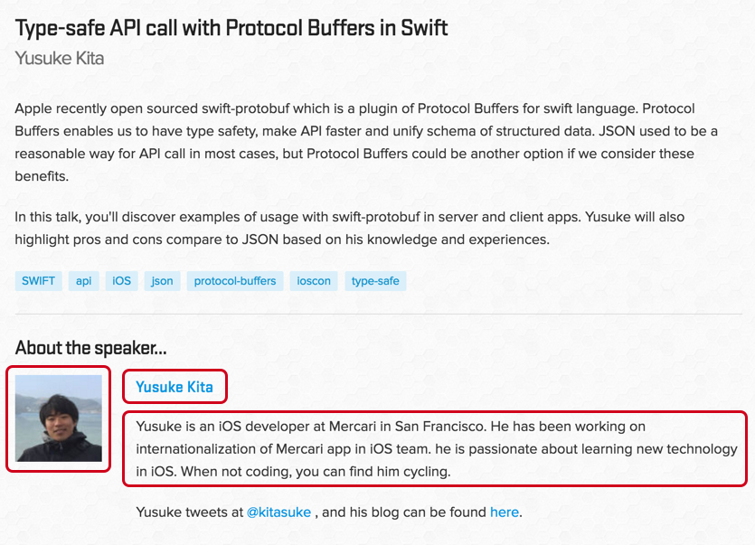

footer: Type-safe Web APIs with Protocol Buffers in Swift, Yusuke Kita (@kitasuke), AltConf 2017
slidenumbers: true

## Type-safe Web APIs with **Protocol Buffers** in **Swift**

^ Hello, everyone! Thanks for coming to my talk. It's an honor to be here as a speaker and super excited to talk about Protocol Buffers today.
I'm also happy to attend both WWDC and AltConf, coz it's my first time I got the ticket! I'm having wonderful days!
Anyways, I'm just curious that how many people have you heard about Protocol Buffers so far?
Cool! I see many people don't know about that, well, that's good. That's why I'm here.
Today, I want to share my experiences and knowledge about Protocol Buffers and I hope you could learn something nice about it from my talk.

---

# Hi, I'm Yusuke
## @kitasuke


^ My name is Yusuke, I work at Mercari in San Francisco. Our product is a marketplace app and we currently support three regions, Japan, US and UK
We, as US team have been working on internationalization of our app for US market and we've been using Protocol Buffers in our project.

---

# I'm going to talk about...

- What Protocol Buffers are

^ I'm going to go over Protocol Buffers briefly and dive into details later.

---

# I'm going to talk about...

- What Protocol Buffers are
- Pros and Cons

^ Next Pros and Cons. I believe that Protocol Buffers have many benefits for us, but I know everything has cons.
It's totally depends on your use case whether it's worth it or not.

---

# I'm going to talk about...

- What Protocol Buffers are
- Pros and Cons
- Where to start

^ Finally, I'm going to tell you where you can start from. This is really important.
Let's say Swift. Swift is awesome, but sometimes it's difficult to use swift into your existing code base.
It's better to have some places to try it out like playgrounds.
Alright, let's get it started

---

# [fit] **Web APIs**

^ Before we go over Protocol Buffers, Let's talk about Web APIs first.
Most of app have network communications. You call many web APIs from client apps.

---

# [fit] **JSON**

^ Most likely JSON would be a standard way to serialize data.
JSON is good, but sometimes I feel like it's not Swifty...
Why do I feel so?

---

## HTTP Request
# JSON :arrow_right: Data

^ Let's say you call Web API.
So you have HTTP request, you gotta to convert JSON object to data type

---

```swift
let json = ["id": 1]
let data = try? JSONSerialization.data(
    withJSONObject: json,
    options: []
)

var request = URLRequest(url: url)
request.httpBody = data
```

^ Code would be something like this. This request is to fetch user info from server by user id.
You gotta set user id to JSON object, btw JSON object is Dictionary type.
So for this case, key is `id` which is string and value is `1` which is Int.
Then you serialize and set it to HTTP body

---

## HTTP Response
# Data :arrow_right: JSON

^ In the same way, you have HTTP response, you gotta convert data type to JSON object.


---

```swift
// {"user": {"name": "Yusuke"}}
URLSession.shared.dataTask(with: request) { (data, _, _) in
    let json = (try? JSONSerialization.jsonObject(
        with: data!,
        options: []
    )) as? [String: Any]
    let user = json?["user"] as? [String: Any]
    let name = user?["name"] as? String
}
```

^ Code would be something like this. You get user info from server and this case you want to know user name which is String.
Again JSON object is Dictionary, so you have to cast to whatever value you want which brings so many optionals!

---

## {"isTyped": false, "status": "disappointed"}

^ So, JSON is not type-safe at all. Because we are not sure what type of value is in Dictionary. It could be Int, String or even Dictionary in Dictionary.
Ever since Swift was introduced, we love typed.
To be honest, when I used to write ObjC, I thought like type? hnn Okay, but now I'm like what it's not typed? omg any type everywhere...
I feel kind of disappointed to see this about JSON.

---

# [fit] `[AnyHashable: Any]`

^ Why it's not typed? Because It's Any type.

---

# `Any?`

^ Literally Any type can be any.

---

# :sob:

^ Noooooo, we don't wanna see this in Swift. Because it's simply not Swifty.

---

# [fit] **Protocol**
# [fit] **Buffers**
## a.k.a protobuf

^ Good news!, now you have Protocol Buffers a.k.a protobuf
protobuf was developed by Google in 2008, it's about almost ten years ago and they've been using protobuf in their internal services.
But recently I found it in public services as well, like Firebase and also If you are familiar with server side, you might know about gRPC which is a framework for RPC. They use protobuf as well.

---

# <br>

> Protocol buffers are Google's language-neutral, platform-neutral, extensible mechanism for serializing structured data – think XML, but smaller, faster, and simpler.
-- Google

^ When I read this, honestly I didn't quite understand what it is. I was like XML? seriously now?
But I can understand what it means.

---

> Serialization format
- think JSON, but
smaller, faster and safer
-- Yusuke

^ So I made it simpler with my own words

---

# **Serialization Format**

^ protobuf is all about serialization format.
My talk title says it's Web APIs, but actually it's not the only use case.
You can use them for like local storage as well. It's totally same as JSON.

---

## Why are **Protocol Buffers** a big deal?

^ But JSON is great, that's why widely used.
I'm going to explain why it's a big deal.

---

## HTTP Request
# JSON :arrow_right: Data

^ Remember, you have HTTP request

---

```swift
let json = ["id": 1]
let data = try? JSONSerialization.data(
    withJSONObject: json,
    options: []
)

var request = URLRequest(url: url)
request.httpBody = data
```

^ You send user id to fetch user info from server.

---

## HTTP Request
# ~~JSON~~ :arrow_right: Data

^ What if you use protobuf instead

---

## HTTP Request
## UserRequest :arrow_right: Data

^ Now you have `UserRequest` type instead of JSON object. Where is it coming from? I defined the type.
protobuf lets you define your custom type which is `UserRequest` type for the case.

---

```swift
// custom type
let userRequest = UserRequest.with {
    $0.id = 1
}
let body = try? userRequest.serializedData()

var request = URLRequest(url: url)
request.httpBody = body
```

^ What's `UserRequest` type? It has id property which is Int, What you have to do is to set `Int` value to id property.
You don't need to specify key name every time, just set it to property. It's so simple, right?
Also serialization method is implemented by protobuf, so you can just call `serializedData` method to serialize `UserRequest` type.

---

## HTTP Response
# Data :arrow_right: JSON

^ In the same way, you have HTTP response.

---

```swift
// {"user": {"name": "Yusuke"}}
URLSession.shared.dataTask(with: request) { (data, _, _) in
    let json = (try? JSONSerialization.jsonObject(
        with: data!,
        options: []
    )) as? [String: Any]
    let user = json?["user"] as? [String: Any]
    let name = user?["name"] as? String
}
```

^ You get user info

---

## HTTP Response
# Data :arrow_right: ~~JSON~~

^ What if you use protobuf

---

## HTTP Response
## Data :arrow_right: UserResponse

^ You have `UserResponse` type.

---

```swift
// UserResponse(user: User(name: "Yusuke"))
URLSession.shared.dataTask(with: request) { (data, _, _) in
    // custom type
    guard let response = try? UserResponse(serializedData: data!) else {
        // error
        return
    }
    let user = response.user
    let name =  user.name
}
```

^ `UserResponse` type has user property which contains name property.
Deserialization method is also implemented by protobuf, so simply call it to deserialize to `UserResponse` type.
And you can access to name property to get value.
That's it!

---

```swift
Protobuf(
    isTyped: true,
    status: .happy
)
```

^ Everything is typed by protobuf! I'm pretty happy to see this.

---

# :satisfied:

^ You don't need to deal with `Any` type any more.
I think protobuf would gonna be a best fit to Swift, because it's all typed. That's why protobuf is a big deal for us.

---

# But how do they work?

---

## protobuf
### [google/protobuf](https://github.com/google/protobuf)


^ Don't worry, protobuf compiler itself supports Objective-C.
Either way, you need this and you better have the latest version.

---

## protobuf for Swift
### [apple/swift-protobuf](https://github.com/apple/swift-protobuf)


^ You need a plugin which is official one from Apple. They open sourced last year.
This is just a plugin for Swift language, it's not Protocol Buffers itself.
You could have another option which is unofficial one, but I'm not gonna cover during my talk.

---

> "But we still use Objective-C :cry:"

^ I know, there is no such a perfect world. This is reality.

---

1. Define message types
2. Generate code
3. Serialize/Deserialize

^ There are 3 things you have to do. I'm going to explain one by one.

---

1. **Define message types**
2. Generate code
3. Serialize/Deserialize

---

## **Message types** define data structures <br/> in `.proto` files

^ What is message type?

---

## **Message types** have key-value pairs

---


^ It's easier to understand with example. Let's think about data structures.
This is my talk info page from iOSCon in London this year

---



`user.proto`

```swift
syntax = "proto3"; // protoc version

message User {
    int32 id = 1; // field number
    string name = 2;
    string introduction = 3;
    string photoUrl = 4;
    Type type = 5;

    enum Type {
        Speaker = 0;
        Attendee = 1;
    }
}
```

^ Let's make user data structure at first. It has id, name, introduction, photoUrl and type.
It has basic info of user.
You have to specify protoc version which is currently 3, but you don't need to think about it for now.
And also each field requires to have a field number.

---


`talk.proto`

```swift
syntax = "proto3";

import "user.proto";

message Talk {
    int32 id = 1;
    string title = 2;
    string desc = 3;
    User speaker = 4;
    repeated string tags = 5; // Array
}
```

^ Next, talk data structure. It has id, title, description, speaker and tags.

---

1. Define message types
2. **Generate code**
3. Serialize/Deserialize

^ Now you have data structures. Next code generator.

---

## protobuf compiler **generates code** from `.proto` file

---

# Basic types

`Int32`, `UInt32`, `Int64`, `UInt64`, `Bool`, `Float`, `Double`, `String`, `Array`, `Dictionary`, `Data`</br>

^ protobuf supports most of types in message types

---

# Supported languages

C, C++, C#, Go, Haskell, Java, Javascript, **Objective-C**, PHP, Python, Ruby, Rust, Scala, **Swift** etc.

^ Also protobuf supports lots of languages. I just picked up randomly, so there are more supported languages.

---

# Swift features

- `struct`, not `class`
- enum `RawValue` is `Int`
- Default value is set

^ These are Swift features.
protobuf generate `struct`, not `class`.
Enum's `RawValue` is always `Int`
Default value is always set to properties.

---


^ Let's take a look at how code is generated in Swift.

---

`user.proto`

```swift
syntax = "proto3"; // protoc version

message User {
    int32 id = 1; // field number
    string name = 2;
    string introduction = 3;
    string photoUrl = 4;
    Type type = 5;

    enum Type {
        Speaker = 0;
        Attendee = 1;
    }
}
```

---

`user.pb.swift`

```swift
// struct
struct User: SwiftProtobuf.Message, ... {
    init() {}

    enum Type: SwiftProtobuf.Enum {
        typealias RawValue = Int // always Int
        case speaker // = 0
        case attendee // = 1
        case UNRECOGNIZED(Int)
    }

    // property has default value
    var id: Int32 = 0
    var name: String = String()
    var introduction: String = String()
    var photoURL: String = String()
    var type: User.TypeEnum = .speaker
}
```

^ `user.proto` file generates `user.pb.swift` file. This is not entire code in this file, I just took important part.
`User` struct has properties you defined in message type.
As I told you, all of properties has default values. Therefore, property is `var`, not `let`.

---

`talk.proto`

```swift
syntax = "proto3";

import "user.proto";

message Talk {
    int32 id = 1;
    string title = 2;
    string desc = 3;
    User speaker = 4;
    repeated string tags = 5; // Array
}
```

---

`talk.pb.swift`

```swift
struct Talk: SwiftProtobuf.Message, ... {
    init() {}

    var id: Int32 = 0
    var title: String = String()
    var speaker: User = User()
    var desc: String = String()
    var tags: [String] = []
}
```

^ In the same way, `talk.proto` file generates `talk.pb.swift` file.

---


^ This is Java file which could be used in Android

---

`User.java`

```java
public static final class User extends Message<User, User.Builder> {
    public final Integer id;
    public final String name;
    public final String introduction;
    public final String photoUrl;
    public final Type type;
}
```

---

`Talk.java`

```java
public final class Talk extends Message<Talk, Talk.Builder> {
    public final Integer id;
    public final String title;
    public final User speaker;
    public final String summary;
    public final List<String> tags;
}
```

---


^ This is Go file which could be used in server side.

---

`user.pb.go`

```go
type User_Type int32

const (
	User_Speaker User_Type = 0
	User_Attendee User_Type = 1
)

type User struct {
	ID           int32  `protobuf:"varint,1,opt,name=id,proto3" json:"id,omitempty"`
	Name         string `protobuf:"bytes,2,opt,name=name,proto3" json:"name,omitempty"`
    Introduction string `protobuf:"bytes,3,opt,name=introduction,proto3" json:"introduction,omitempty"`
	PhotoURL     string `protobuf:"bytes,4,opt,name=photoUrl,proto3" json:"photoUrl,omitempty"`
    Type      User_Type `protobuf:"varint,5,opt,name=type,proto3,enum=api.User_Type" json:"type,omitempty"`
}
```

---

`talk.pb.go`

```go
type Talk struct {
	ID      int32     `protobuf:"varint,1,opt,name=id,proto3" json:"id,omitempty"`
	Title   string    `protobuf:"bytes,2,opt,name=title,proto3" json:"title,omitempty"`
	Speaker *User     `protobuf:"bytes,3,opt,name=speaker" json:"speaker,omitempty"`
    Summary string    `protobuf:"bytes,4,opt,name=summary,proto3" json:"summary,omitempty"`
	Tags    []string  `protobuf:"bytes,5,rep,name=tags" json:"tags,omitempty"`
}
```

---

## **One** message type
## :arrow_down:
## **Multiple** languages code

^ protobuf generates multiple languages code from one message type.

---

## **Less communication, More collaboration**
### with other platforms

^ It's gonna be less communication, more collaboration with other platforms!
You don't need to struggle with outdated API documents any more.
Because message types themselves are definition of structured data.

---

1. Define message types
2. Generate source files
3. **Serialize/Deserialize**

^ Now you have modal structs. Finally serialization for them.

---

# Serialization

```Swift
public func serializedData(partial: Bool = default) throws -> Data

public func jsonString() throws -> String

public func textFormatString() throws -> String
```

^ Again, serialization method is implemented by protobuf. even for JSON or text.

---

```Swift
let user = User.with {
    $0.id = 1
    $0.type = .speaker
    $0.name = "kitasuke"
}

let talk = Talk.with {
    $0.id = 1
    $0.title = "Type-safe Web APIs with Protocol Buffers in Swift"
    $0.speaker = user
    $0.tags = ["swift", "iOS", "protocol-buffers", "altconf", "type-safe"]
}

let data = try? talk.serializedData()
```

^ This is how you serialize data.
There is nothing special

---

# Deserialization

```Swift
public convenience init(serializedData data: Data,
    extensions: ExtensionMap = default,
    partial: Bool = default) throws

public convenience init(jsonString: String) throws

public convenience init(jsonUTF8Data: Data) throws

public convenience init(textFormatString: String,
    extensions: ExtensionMap? = default) throws
```

^ Same as serialization

---

```swift
let talk = try? Talk(serializedData: data)

let title = talk?.title
let speaker = talk?.speaker
let tags = talk?.tags
```

---

## How serialization works

---

# **Binary Encoding**

---

# Key factor

1. Field number
2. Wire type

---

# Field number

```swift
message Talk {
    int32 id = 1; ← // Field number
    string title = 2;
    string desc = 3;
    User speaker = 4;
    repeated string tags = 5;
}
```

^ It shouldn't be in order, but should be unique.

---

# Wire type

| Type | Meaning          | Used For  ||
| :--- | :----------------| :-------- | :-- |
| 0    | Varint           | int32, int64, uint32, uint64, sint32, sint64, bool, enum ||
| 1    | 64-bit	          | fixed64, sfixed64, double ||
| 2    | Length-delimited | string, bytes, embedded messages, packed repeated fields    ||
| 3    |                  | (deprecated)   ||
| 4    |                  | (deprecated)  ||
| 5    | 32-bit           | fixed32, sfix3d32, float  ||

---

```swift
// message type
message Test1 {
    int32 a = 1;
}
test1.a = 300
```

```
// encoded message
08 96 01

08 // field number and wire type
96 01 // value which is 300
```

---

## Small and Numeric

---

## **High network performance**

---

# Demo
### [kitasuke/SwiftProtobufSample](https://github.com/kitasuke/SwiftProtobufSample)


^ Server side(Kitura), Simulator, Error handling,

---

# Quick Recap

---

# Quick Recap

- Type-safety

---

# Quick Recap

- Type-safety
- Shared data model

---

# Quick Recap

- Type-safety
- Shared data model
- High performance

---

## You might have concerns about...

---

# Versioning

---

# Backward compatibility

- Unknown field is ignored
- Default value for missing field

^ protobuf does support backward compatibility. If there is an unknown field, it's ignored.
If there is missing field, default value is set to it.

---

# Backward compatibility

- Unknown field is ignored
- Default value for missing field

### as long as you don't change existing **field number** or **wire type**

^ You are not supposed to change existing field number or wire type, because these are the keys to encode to binary.

---

## Coexistence of
## **protobuf** & **JSON**

---

## Absolutely you can!

^ Using protobuf doesn't mean you have to quit using JSON. You can use both of protobuf and JSON in your app.

---

## `Accept` & `Content-Type`

- `application/protobuf` - protobuf
- `application/json` - JSON

^ You can handle with `Accept` and `Content-Type` in HTTP header.

---

# HTTP Request

```Swift

var request = URLRequest(url: url)
if protobuf {
    request.setValue("application/protobuf", forHTTPHeaderField: "Content-Type")
    request.setValue("application/protobuf", forHTTPHeaderField: "Accept")
} else if json {
    request.setValue("application/json", forHTTPHeaderField: "Content-Type")
    request.setValue("application/json", forHTTPHeaderField: "Accept")
}
request.body = try? userRequest.serializedData()

```

^ When you build HTTP request, set `application/protobuf` to `Content-Type` and `Accept`, so that you could get response with protobuf data.

---

# HTTP Response

```swift

URLSession.shared.dataTask(with: request) { (data, urlResponse, _) in
    let httpURLResponse = urlResponse as? HTTPURLResponse
    let contentType = httpURLResponse?.allHeaderFields["Content-Type"] as? String

    let response: Response?
    if contentType == "application/protobuf" {
        response = try? Response(serializedData: data!)
    } else if contentType == "application/json" {
        response = try? Response(jsonUTF8Data: data!)
    }
}
```

^ Check `Content-Type` of response in HTTP header, then deserialize it to whatever content type is.

---

# Sounds good
# so far :+1:

^ protobuf sounds great!

---

# So, what are Cons?

^ But you know, there are always cons.

---

# Not human-readable

- Binary data is not understandable

^ Binary data is not human readable. If you see some logs in console, you would'n know what's going on.
But once you decode to string or deserialize it

---

# Time investment

- Time consuming at the beginning
- Involvement from other platforms

^ It might take so much time especially at the beginning to build foundation.
And you may need to get Involvement from other platforms like Android or Server side.
It's totally depends on how much resources you have to introduce protobuf into your project.

---

# Swift version

- Watch Swift version of protobuf plugin
- Specify tag version if you use older version

^ In case your project don't use the latest version of Swift, make sure that it doesn't conflict with version in plugin.
For that case, don't forget to specify tag version which works in your project.

---

# Stability

- Still pre-release version only for Swift :warning:
- Contribute if you find a bug :rocket:

^ There are already enough functions, but drastic changes often happen to swift-protobuf, not for protobuf itself.
I haven't faced any big issue yet, but if you do so, maybe it's a good chance to contribute to them.
I guess that's one of the reasons they opensourced swift-protobuf.

---

# Where should we start?

^ Alright, sounds like a good one! But where should we start? That's really important question.

---

## Internal service

- Easy to adapt
- Small start

^ Maybe you can start using protobuf just like same as Google does.
No need to think about existing architecture, it's easy to adapt.
It's gonna be small start which doesn't take so much time to introduce.

---

## Data store

- Database
- NSKeyedArchiver
- NSCache

^ Or maybe you can use protobuf for data store. Network layer could be a giant codebase, but it's not the only place you serialize data.
Especially if you write Swift, you might feel frustrated by `NSKeyedArchiver` or `NSCache`.
Since it's `NS` family, it doesn't accept Swift value which is so annoying.
Using protobuf could be the solution for that case.

---

## Parsing library

- JSON parser
- Server side Swift

^ Or maybe you can use protobuf just like JSON parser, because it supports JSON serialization as well.
Especially if you server side Swift project, it's gonna be a good chance.

---

# Conclusion

---

# Conclusion

- Swifty

---

# Conclusion

- Swifty
- Consistent in Cross-platform

---

# Conclusion

- Swifty
- Consistent in Cross-platform
- Better performance

---

# **It's definitely worth it** :muscle:

---

## In Production
## 70M Downloads
## :us::uk::jp:


---

# [fit] **One more thing...**

---

# Codable :tada:

---

```swift
/// A type that can convert itself into and out of an external representation.
public typealias Codable = Decodable ＆ Encodable
```

---

```swift
/// A type that can encode itself to an external representation.
public protocol Encodable {

    /// Encodes this value into the given encoder.
    ///
    /// If the value fails to encode anything, `encoder` will encode an empty
    /// keyed container in its place.
    ///
    /// This function throws an error if any values are invalid for the given
    /// encoder's format.
    ///
    /// - Parameter encoder: The encoder to write data to.
    public func encode(to encoder: Encoder) throws
}
```

---

```swift
/// A type that can decode itself from an external representation.
public protocol Decodable {

    /// Creates a new instance by decoding from the given decoder.
    ///
    /// This initializer throws an error if reading from the decoder fails, or
    /// if the data read is corrupted or otherwise invalid.
    ///
    /// - Parameter decoder: The decoder to read data from.
    public init(from decoder: Decoder) throws
}
```

---

```swift
struct UserRequest: Codable {
    let id: Int
}

let encoder = JSONEncoder()
let userRequest = UserRequest(id: 1)
let data = try? encoder.encode(userRequest)
```

---

```swift
struct UserResponse: Codable {
    let user: User

    struct User: Codable {
        let name: String
    }
}

let decoder = JSONDecoder()
let response = try? decoder.decode(UserResponse.self, from: data)
let name = response?.user.name
```

---

```swift
struct NetworkError: Codable {
    let code: Code

    enum Code: Int, Codable {
    case unknown = 0
    case badRequest = 400
    case unauthorized = 401
    case forbidden = 403
    case notFound = 404
    case internalServerError = 500
    }
}

let decoder = JSONDecoder()
let response = try? decoder.decode(NetworkError.self, from: data)
let code = response?.code
```

---

```swift
Codable(
    isTyped: true,
    status: .excited
)
```

---

# [fit] Awesome :+1:

---

# Credits

[Protocol Buffers](https://developers.google.com/protocol-buffers/)
[swift-protobuf](https://github.com/apple/swift-protobuf)
[Kitura](https://developer.ibm.com/swift/kitura/)
[Protocol Buffers in your Kitura Apps](https://developer.ibm.com/swift/2016/09/30/protocol-buffers-with-kitura/)

---

# Thank you!
GitHub: [https://github.com/kitasuke](https://github.com/kitasuke)
Demo: [SwiftProtobufSample](https://github.com/kitasuke/SwiftProtobufSample)
Twitter: [@kitasuke](https://twitter.com/kitasuke)
Email: yusuke2759@gmail.com
