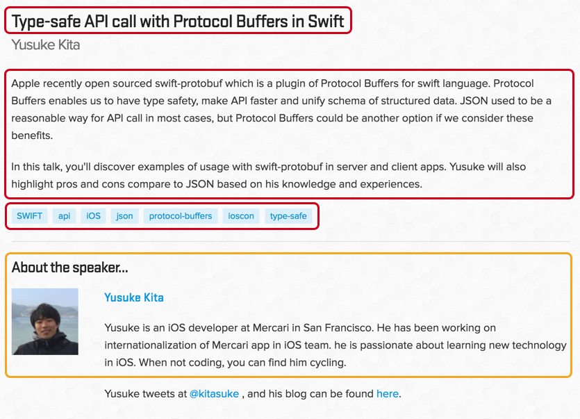

footer: Type-safe Web APIs with Protocol Buffers in Swift, Yusuke Kita (@kitasuke), iOSCon 2017
slidenumbers: true

## Type-safe Web APIs with **Protocol Buffers** in **Swift**

---

# Hi, I'm Yusuke
## @kitasuke


---

# I'm going to talk about...

- What Protocol Buffers are

---

# I'm going to talk about...

- What Protocol Buffers are
- Pros and Cons

---

# I'm going to talk about...

- What Protocol Buffers are
- Pros and Cons
- Where to start

---

# [fit] **Web APIs**

---

# [fit] **JSON**

---

## HTTP Request
# JSON :arrow_right: Data

---

```swift
let json = ["id": 1]
let data = try? JSONSerialization.data(withJSONObject: json,
    options: .prettyPrinted)

var request = URLRequest(url: url)
request.httpBody = data
```

---

## HTTP Response
# Data :arrow_right: JSON

---

```swift
// {"user": {"name": "Yusuke"}}
URLSession.shared.dataTask(with: request) { (data, _, _) in
    let json = (try? JSONSerialization.jsonObject(with: data!,
        options: .allowFragments)) as? [AnyHashable: Any]
    let user = json?["user"] as? [AnyHashable: Any]
    let name = user?["name"] as? String
}
```

---

## {"isTyped": false, "status": "disappointed"}

---

# [fit] `[AnyHashable: Any]`

---

# `Any?`

---

# :sob:

---

# [fit] **Protocol**
# [fit] **Buffers**
## a.k.a protobuf

---

# <br>

> Protocol buffers are Google's language-neutral, platform-neutral, extensible mechanism for serializing structured data – think XML, but smaller, faster, and simpler.
-- Google

---

> Serialization format
- think JSON, but
smaller, faster and safer
-- Yusuke

---

# **Serialization Format**

---

## Why are **Protocol Buffers** a big deal?

---

## HTTP Request
# JSON :arrow_right: Data

---

```swift
let json = ["id": 1]
let data = try? JSONSerialization.data(withJSONObject: json,
    options: .prettyPrinted)

var request = URLRequest(url: url)
request.httpBody = data
```

---

## HTTP Request
# ~~JSON~~ :arrow_right: Data

---

## HTTP Request
## UserRequest :arrow_right: Data

---

```swift
// custom type
let userRequest = UserRequest.with {
    $0.id = 1
}
let body = try? body.serializedData()

var request = URLRequest(url: url)
request.httpBody = body
```

---

## HTTP Response
# Data :arrow_right: JSON

---

```swift
// {"user": {"name": "Yusuke"}}
URLSession.shared.dataTask(with: request) { (data, _, _) in
    let json = (try? JSONSerialization.jsonObject(with: data!,
        options: .allowFragments)) as? [AnyHashable: Any]
    let user = json?["user"] as? [AnyHashable: Any]
    let name = user?["name"] as? String
}
```

---

## HTTP Response
# Data :arrow_right: ~~JSON~~

---

## HTTP Response
## Data :arrow_right: UserResponse

---

```swift
// UserResponse(user: User(name: "Yusuke"))
URLSession.shared.dataTask(with: request) { (data, _, _) in
    // custom type
    guard let response: UserResponse = try? UserResponse(serializedData: data!) else {
        // error
        return
    }
    let user = response.user
    let name =  user.name
}
```

---

```swift
Protobuf(
    isTyped: true,
    status: .satisfied
)
```

---

# :satisfied:

---

# But how do they work?

---

## protobuf for Swift
### [apple/swift-protobuf](https://github.com/apple/swift-protobuf)


---

> "But we still use Objective-C :cry:"

---

## protobuf
### [google/protobuf](https://github.com/google/protobuf)


---

1. Define message types
2. Generate code
3. Serialize/Deserialize

---

1. **Define message types**
2. Generate code
3. Serialize/Deserialize

---

## **Message types** define data structures <br/> in `.proto` files

---

## **Message types** have key-value pairs

---


---


`user.proto`

```swift
syntax = "proto3"; // protoc version

message User {
    int32 id = 1; // field number
    string name = 2;
    string introduction = 3;
    string photoUrl = 4;
    ParticipantType participantType = 5;

    enum ParticipantType {
        Speaker = 0;
        Attendee = 1;
    }
}
```

---



`talk.proto`

```swift
syntax = "proto3";

import "user.proto";

message Talk {
    int32 id = 1;
    string title = 2;
    string desc = 3;
    User speaker = 4;
    repeated string tags = 5; // Array
}
```

---

1. Define message types
2. **Generate code**
3. Serialize/Deserialize

---

## protobuf compiler **generates code** from `.proto` file

---

# Basic types

`Int32`, `UInt32`, `Int64`, `UInt64`, `Bool`, `Float`, `Double`, `String`, `Array`, `Dictionary`, `Data`</br>

---

# Supported languages

C, C++, C#, Erlang, Go, Haskell, Java, Javascript, **Objective-C**, Perl, PHP, Python, Ruby, Rust, Scala, **Swift** etc.

---

# Swift features

- `struct`, not `class`
- enum `RawValue` is `Int`
- Default value is set

---


---

`user.proto`

```swift
syntax = "proto3"; // protoc version

message User {
    int32 id = 1; // field number
    string name = 2;
    string introduction = 3;
    string photoUrl = 4;
    ParticipantType participantType = 5;

    enum ParticipantType {
        Speaker = 0;
        Attendee = 1;
    }
}
```

---

`user.pb.swift`

```swift
// struct
struct User: SwiftProtobuf.Message, ... {
    init() {}

    enum Type: SwiftProtobuf.Enum {
        typealias RawValue = Int // always Int
        case speaker // = 0
        case participant // = 1
        case UNRECOGNIZED(Int)
    }

    // property has default value
    var id: Int32 = 0
    var name: String = ""
    var introduction: String = ""
    var photoURL: String = ""
    var participantType: User.ParticipantType = .speaker
}
```

---

`talk.proto`

```swift
syntax = "proto3";

import "user.proto";

message Talk {
    int32 id = 1;
    string title = 2;
    string desc = 3;
    User speaker = 4;
    repeated string tags = 5; // Array
}
```

---

`talk.pb.swift`

```swift
struct Talk: SwiftProtobuf.Message, ... {
    init() {}

    var id: Int32 = 0
    var title: String = ""
    var speaker: User = User()
    var desc: String = ""
    var tags: [String] = []
}
```

---


---

`User.java`

```java
public static final class User extends Message<User, User.Builder> {
    public final Integer id;
    public final String name;
    public final String introduction;
    public final String photoUrl;
    public final ParticipantType participantType;
}
```

---

`Talk.java`

```java
public final class Talk extends Message<Talk, Talk.Builder> {
    public final Integer id;
    public final String title;
    public final User speaker;
    public final String summary;
    public final List<String> tags;
}
```

---


---

`user.pb.go`

```go
type User_Type int32

const (
	User_Speaker User_ParticipantType = 0
	User_Attendee User_ParticipantType = 1
)

type User struct {
	ID           int32  `protobuf:"varint,1,opt,name=id,proto3" json:"id,omitempty"`
	Name         string `protobuf:"bytes,2,opt,name=name,proto3" json:"name,omitempty"`
    Introduction string `protobuf:"bytes,3,opt,name=introduction,proto3" json:"introduction,omitempty"`
	PhotoURL     string `protobuf:"bytes,4,opt,name=photoUrl,proto3" json:"photoUrl,omitempty"`
    Type      User_Type `protobuf:"varint,5,opt,name=type,proto3,enum=api.User_Type" json:"type,omitempty"`
}
```

---

`talk.pb.go`

```go
type Talk struct {
	ID      int32     `protobuf:"varint,1,opt,name=id,proto3" json:"id,omitempty"`
	Title   string    `protobuf:"bytes,2,opt,name=title,proto3" json:"title,omitempty"`
	Speaker *User     `protobuf:"bytes,3,opt,name=speaker" json:"speaker,omitempty"`
    Summary string    `protobuf:"bytes,4,opt,name=summary,proto3" json:"summary,omitempty"`
	Tags    []string  `protobuf:"bytes,5,rep,name=tags" json:"tags,omitempty"`
}
```

---

## **One** message type
## :arrow_down:
## **Multiple** languages code

---

## **Less communication, More collaboration**
### with other platforms

---

1. Define message types
2. Generate source files
3. **Serialize/Deserialize**

---

# Serialization

```Swift
public func serializedData(partial: Bool = default) throws -> Data

public func jsonString() throws -> String

public func textFormatString() throws -> String
```

---

```Swift
let user = User.with {
    $0.id = 1
    $0.type = .speaker
    $0.name = "kitasuke"
}

let talk = Talk.with {
    $0.id = 1
    $0.title = "Type-safe Web APIs with Protocol Buffers in Swift"
    $0.speaker = user
    $0.tags = ["swift", "iOS", "protocol-buffers", "ioscon", "type-safe"]
}

let data = try? talk.serializedData()
```

---

# Deserialization

```Swift
public convenience init(serializedData data: Data,
    extensions: SwiftProtobuf.ExtensionSet? = default,
    partial: Bool = default) throws

public convenience init(jsonString: String) throws

public convenience init(textFormatString: String,
    extensions: SwiftProtobuf.ExtensionSet? = default) throws
```

---

```swift
let talk = try? Talk(serializedData: data)

let title = talk?.title
let speaker = talk?.speaker
let tags = talk?.tags
```

---

## How serialization works

---

# **Binary Encoding**

---

# Key factor

1. Field number
2. Wire type

---

# Field number

```swift
message Talk {
    int32 id = 1; ← // Field number
    string title = 2;
    string desc = 3;
    User speaker = 4;
    repeated string tags = 5;
}
```

---

# Wire type

| Type | Meaning          | Used For  ||
| :--- | :----------------| :-------- | :-- |
| 0    | Varint           | int32, int64, uint32, uint64, sint32, sint64, bool, enum ||
| 1    | 64-bit	          | fixed64, sfixed64, double ||
| 2    | Length-delimited | string, bytes, embedded messages, packed repeated fields    ||
| 3    |                  | (deprecated)   ||
| 4    |                  | (deprecated)  ||
| 5    | 32-bit           | fixed32, sfix3d32, float  ||

---

```swift
// message type
message Test1 {
    int32 a = 1;
}
test1.a = 300
```

```
// encoded message
08 96 01

08 // field number and wire type
96 01 // value which is 300
```

---

## So small and numeric

---

## **High network performance**

---

# Demo
### [kitasuke/SwiftProtobufSample](https://github.com/kitasuke/SwiftProtobufSample)


---

# Quick Recap

---

# Quick Recap

- Type-safety

---

# Quick Recap

- Type-safety
- Shared data model

---

# Quick Recap

- Type-safety
- Shared data model
- High performance

---

## You might have concerns about...

---

# Versioning

---

# Backward compatibility

- Unknown field is ignored
- Default value for missing field

---

# Backward compatibility

- Unknown field is ignored
- Default value for missing field

### as long as you don't change existing **field number** or **wire type**

---

## Coexistence of
## **protobuf** & **JSON**

---

## Absolutely you can!

---

## `Accept` & `Content-Type`

- `application/protobuf` - protobuf
- `application/json` - JSON

---

# HTTP Request

```Swift

var request = URLRequest(url: url)
if protobuf {
    request.setValue("application/protobuf", forHTTPHeaderField: "Content-Type")
    request.setValue("application/protobuf", forHTTPHeaderField: "Accept")
} else if json {
    request.setValue("application/json", forHTTPHeaderField: "Content-Type")
    request.setValue("application/json", forHTTPHeaderField: "Accept")
}

```

---

# HTTP Response

```swift

URLSession.shared.dataTask(with: request) { (data, urlResponse, _) in
    let httpURLResponse = urlResponse as? HTTPURLResponse
    let contentType = httpURLResponse?.allHeaderFields["Content-Type"] as? String

    if contentType == "application/protobuf" {
        let response = try? Response(serializedData: data!)
    } else if contentType == "application/json" {
        let response = try? Response(jsonString: data!)
    }
}
```

---

# Sounds good
# so far :+1:

---

# So, what are Cons?

---

# Not human-readable

- Binary data is not understandable

---

# Time investment

- Time consuming at the beginning
- Involvement from other platforms

---

# Swift version

- Watch Swift version of protobuf plugin
- Specify tag version if you use older version

---

# Stability

- Still pre-release version only for Swift :warning:
- Contribute if you find a bug :rocket:

---

# Where should we start?

---

## Internal service

- Easy to adapt
- Small start

---

## Data store

- Database
- NSKeyedArchiver
- NSCache

---

## Parsing library

- JSON parser
- Server side Swift

---

# Conclusion

---

# Conclusion

- Swifty

---

# Conclusion

- Swifty
- Consistent in Cross-platform

---

# Conclusion

- Swifty
- Consistent in Cross-platform
- Extensible

---

# **It's definitely worth it** :muscle:

---

## Partially in Production
## 70M Downloads
## :us::uk::jp:


---

# Credits

[Protocol Buffers](https://developers.google.com/protocol-buffers/)
[swift-protobuf](https://github.com/apple/swift-protobuf)
[Kitura](https://developer.ibm.com/swift/kitura/)
[Protocol Buffers in your Kitura Apps](https://developer.ibm.com/swift/2016/09/30/protocol-buffers-with-kitura/)

---

# Thank you!
GitHub: [https://github.com/kitasuke](https://github.com/kitasuke)
Demo: [SwiftProtobufSample](https://github.com/kitasuke/SwiftProtobufSample)
Twitter: [@kitasuke](https://twitter.com/kitasuke)
Email: yusuke2759@gmail.com
