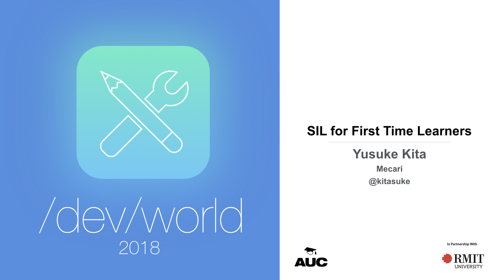

theme: Customized Fira, 1
footer: SIL for First Time Learners, Yusuke Kita (@kitasuke), /dev/world/2018

[.hide-footer]


---

# Hi, I'm Yusuke
## @kitasuke


---

# [fit] 　Why SIL?　

---
[.build-lists: true]

# Why SIL?
- Better idea of Swift type system :apple:
- Optimizations magic :crystal_ball::sparkles:
- For fun and profit :sunglasses:

---

# [fit] 　　SIL　　

---

# [fit] **S**wift
# [fit] **I**ntermediate
# [fit] **L**anguage

---

> **SIL is a language specific Intermediate Representation**

---

# [fit] 　Swift　

---

# [fit] Swift Compiler

---

# Swift Compiler
<br><br><br><br><br>


---

# Swift Compiler
<br><br><br><br><br>


---


# raw SIL
<br><br><br><br><br>


---

# canonical SIL
<br><br><br><br><br>


---

# [fit] 　Objective-C　

---

# [fit] 　　　Clang　　　

---

# Clang
<br><br><br><br><br>


---

# [fit] 　　SIL　　

---

# [fit] How *SIL* works?

---

# `sample.swift`

```swift
func number() -> Int {
    let x: Int
    x = 1
    return x
}
```

---

# Emit SIL

```bash
$swiftc -emit-sil sample.swift > sample.sil
```

---

# `sample.sil`

[.code-highlight: all]
[.code-highlight: 1, 9]
[.code-highlight: 2]
[.code-highlight: 3]
[.code-highlight: 4,5]
[.code-highlight: 6]
[.code-highlight: 7]
[.code-highlight: 8]
[.code-highlight: all]
```llvm
sil hidden @_T06sample6numberSiyF : $@convention(thin) () -> Int {
bb0:
    %0 = alloc_stack $Int, let, name "x"
    %1 = integer_literal $Builtin.Int64, 1
    %2 = struct $Int (%1 : $Builtin.Int64)
    store %2 to %0 : $*Int
    dealloc_stack %0 : $*Int
    return %2 : $Int
}
```

---

# Emit SIL with optimizations

```bash
$swiftc -emit-sil -O sample.swift > sample.sil
```

---

# `sample.sil` with optimizations

[.code-highlight: all]
[.code-highlight: 1,6]
[.code-highlight: 2]
[.code-highlight: 3,4]
[.code-highlight: 5]
[.code-highlight: all]
```llvm
sil hidden @_T06sample6numberSiyF : $@convention(thin) () -> Int {
bb0:
    %0 = integer_literal $Builtin.Int64, 1
    %1 = struct $Int (%0 : $Builtin.Int64)
    return %1 : $Int
}
```

---

# Diff

```llvm, [.highlight: 1-2, 4-5, 8-9]
sil hidden @_T06sample6numberSiyF : $@convention(thin) () -> Int {
bb0:
    %0 = alloc_stack $Int, let, name "x"
    %1 = integer_literal $Builtin.Int64, 1
    %2 = struct $Int (%1 : $Builtin.Int64)
    store %2 to %0 : $*Int
    dealloc_stack %0 : $*Int
    return %2 : $Int
}
```

---

# `sample.swift`

```swift
func number() -> Int {
    let x: Int
    x = 1
    return x
}
```

---

# `sample.swift` with optimizations

```swift
func number() -> Int {
    return 1
}
```

---

# Mem2Reg

---

## Register Promotion of Stack Allocations

---

# [fit] Optimizations :crystal_ball::sparkles:

---
[.build-lists: true]

# Optimization flags

- `-Onone`
- `-O`
- `-Ounchecked`
- `-Osize`

---


## Tips for debug

- `-Xllvm -sil-print-all`
- `-Xllvm -sil-print-only-functions`
- `-Xllvm -sil-print-before/after/around`

---
[.build-lists: true]

# Summary

- Optimize, optimize and optimize :muscle:
- Better idea of how Swift Compiler works :100:
- Definitely worth learning :trophy:

---

# References

- [Swift type in SIL](https://medium.com/swift-in-sil)
- [swift/docs/SIL.rst](https://github.com/apple/swift/blob/master/docs/SIL.rst#sil-stage)
- [Debugging the Swift Compiler](https://github.com/apple/swift/blob/master/docs/DebuggingTheCompiler.rst)
- [Swift's High-Level IR: A Case Study of Complementing LLVM IR with Language-Specific Optimization](https://www.youtube.com/watch?v=Ntj8ab-5cvE)

---

# Thank you!
