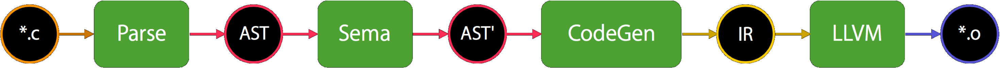

theme: Customized Fira, 1
footer: SIL Optimizations - AllocBoxToStack, Yusuke Kita (@kitasuke), iOSDC 2018

## **SIL Optimizations**
### **AllocBoxToStack**

---

# Hi, I'm Yusuke
## @kitasuke


---

# [fit] 　Why SIL?　

---
[.build-lists: true]

# Why SIL?
- Better idea of Swift type system :apple:
- Optimizations magic :crystal_ball::sparkles:
- Just for fun :sunglasses:

---

# [fit] 　　SIL　　

---

# [fit] **S**wift
# [fit] **I**ntermediate
# [fit] **L**anguage

---

> **SIL is a language specific Intermediate Representation**

---

# [fit] 　Swift　

---

# [fit] Swift Compiler

---

# Swift Compiler
<br><br><br><br><br>


---

# Swift Compiler
<br><br><br><br><br>


---

# SIL
<br><br><br><br><br>


---

# raw SIL
<br><br><br><br><br>


---

# canonical SIL
<br><br><br><br><br>


---

# [fit] 　Objective-C　

---

# [fit] 　　　Clang　　　

---

# Clang
<br><br><br><br><br>


---

# [fit] 　　SIL　　

---

# [fit] Optimizations

---

## Optimization Passes

- CapturePromotion
- AllocBoxToStack
- MandatoryInlining
- DeadCodeElimination
- Mem2Reg
...

---

# [fit] AllocBoxToStack

---

## Stack Promotion of<br> Box Objects

---

## Stack vs Heap

---
[.build-lists: true]

## Stack

- Very fast
- No explicit memory management
- Size limits

---
[.build-lists: true]

## Heap

- Slow
- Explicit memory management
- No size limits

---

## Stack vs Heap

|   Stack  |    Heap   |
| :-----------: | :-----------: |
| Value types | Reference types |
| Pointers to reference type | |

---

## How AllocBoxToStack works?

---

## *alloc_box* :arrow_right: *alloc_stack*

---

## `stack.swift`

```swift
func number() -> Int {
    var x: Int
    x = 1
    return x
}
```

---

## raw SIL

```bash
$swiftc -emit-silgen stack.swift > stack.sil
```

---

## `stack.sil`

[.code-highlight: all]
[.code-highlight: 1-3]
```llvm
%0 = alloc_box ${ var Int }, var, name "x"      
%1 = mark_uninitialized [var] %0 : ${ var Int }
%2 = project_box %1 : ${ var Int }, 0             
...                  
%10 = begin_access [read] [unknown] %2 : $*Int
%11 = load [trivial] %10 : $*Int            
end_access %10 : $*Int                      
destroy_value %1 : ${ var Int }              
return %11 : $Int
```

---

## canonical SIL

```bash
$swiftc -emit-sil stack.swift > stack.sil
```

---

## `stack.sil`

[.code-highlight: all]
[.code-highlight: 1]
```llvm
%0 = alloc_stack $Int, var, name "x"          
%1 = integer_literal $Builtin.Int64, 1        
%2 = struct $Int (%1 : $Builtin.Int64)        
...                   
return %2 : $Int
```

---

## *alloc_box* vs *alloc_stack*

---

## alloc_box

*alloc_box* allocates **a reference counted box on heap**.

---

## alloc_stack

*alloc_stack* allocates a value **on stack**. All allocations must **be deallocated prior to returning from a function**.

---

## **Stack Promotion of<br> Box Objects**

---

## *alloc_box* :arrow_right: ~~*alloc_stack*~~

---

## *alloc_box* :arrow_right: *alloc_box*

---

## `box.swift`

[.code-highlight: all]
[.code-highlight: 5-7, 9-10]
[.code-highlight: 1-3, 8]
```swift
func closure(_ completion: @escaping () -> Void) {
    completion()
}

func number() -> Int {
    var i: Int
    i = 0
    closure { i = 10 }
    return i
}
```

---

## raw SIL

```bash
$swiftc -emit-silgen box.swift > box.sil
```

---

## `box.sil`

[.code-highlight: all]
[.code-highlight: 1-3]
```llvm
%0 = alloc_box ${ var Int }, var, name "i"
%1 = mark_uninitialized [var] %0 : ${ var Int }
%2 = project_box %1 : ${ var Int }, 0
...
%16 = begin_access [read] [unknown] %2 : $*Int
%17 = load [trivial] %16 : $*Int
end_access %16 : $*Int
destroy_value %1 : ${ var Int }
return %17 : $Int
```

---

## canonical SIL

```bash
$swiftc -emit-sil box.swift > box.sil
```

---

## `box.sil`

[.code-highlight: all]
[.code-highlight: 1,2]
```llvm
%0 = alloc_box ${ var Int }, var, name "i"
%1 = project_box %0 : ${ var Int }, 0     
%2 = integer_literal $Builtin.Int64, 0    
%3 = struct $Int (%2 : $Builtin.Int64)                        
...
%12 = begin_access [read] [dynamic] %1 : $*Int
%13 = load %12 : $*Int                        
end_access %12 : $*Int                        
strong_release %0 : ${ var Int }              
return %13 : $Int                             
```

---

## How can promote `alloc_box`?

---

[.code-highlight: all]
[.code-highlight: 1,2,17,18]
[.code-highlight: 4-10]
[.code-highlight: 12-15]
```swift
class AllocBoxToStack : public SILFunctionTransform {
  void run() override {
    ...
    AllocBoxToStackState pass(this);
    for (auto &BB : *getFunction()) {
      for (auto &I : BB)
        if (auto *ABI = dyn_cast<AllocBoxInst>(&I))
          if (canPromoteAllocBox(ABI, pass.PromotedOperands))
            pass.Promotable.push_back(ABI);
    }

    if (!pass.Promotable.empty()) {
      auto Count = rewritePromotedBoxes(pass);
      ...
    }
    ...
  }
};
```

---

[.code-highlight: all]
[.code-highlight: 4,23]
[.code-highlight: 10-13]
[.code-highlight: 15-18]
[.code-highlight: 20-25]
```swift
static SILInstruction * findUnexpectedBoxUse(SILValue Box, bool examinePartialApply,
    bool inAppliedFunction, llvm::SmallVectorImpl<Operand *> &PromotedOperands) {

  llvm::SmallVector<Operand *, 4> LocalPromotedOperands;
  llvm::SmallVector<Operand *, 32> Worklist(Box->use_begin(), Box->use_end());
  while (!Worklist.empty()) {
    auto *Op = Worklist.pop_back_val();
    auto *User = Op->getUser();

    if (isa<StrongRetainInst>(User) || isa<StrongReleaseInst>(User) ||
        isa<ProjectBoxInst>(User) || isa<DestroyValueInst>(User) ||
        (!inAppliedFunction && isa<DeallocBoxInst>(User)))
      continue;

    if (isa<MarkUninitializedInst>(User) || isa<CopyValueInst>(User)) {
      copy(cast<SingleValueInstruction>(User)->getUses(), std::back_inserter(Worklist));
      continue;
    }

    if (auto *PAI = dyn_cast<PartialApplyInst>(User))
      if (examinePartialApply && checkPartialApplyBody(Op) &&
        !partialApplyEscapes(PAI, /* examineApply = */ true)) {
        LocalPromotedOperands.push_back(Op);
        continue;
      }
    return User;
  }
  ...
}
```

---

## Recap

- Promotes **@noescape** values to stack
- **@escaping** values with a reference count

---

## Optimization Flags

---

## `optimized.swift`

[.code-highlight: all]
```swift
func closure(_ completion: @escaping () -> Void) {
    completion()
}

func number() -> Int {
    var i: Int
    i = 0
    closure { i = 10 }
    return i
}
```

---

## canonical SIL with -O

```bash
$swiftc -emit-sil -O optimized.swift > optimized.sil
```

---

## `optimized.sil`

```llvm
%0 = integer_literal $Builtin.Int64, 10
%1 = struct $Int (%0 : $Builtin.Int64)
return %1 : $Int                      
```

---

## No *alloc_box* or *alloc_stack*

---

# Mem2Reg

---

## Register Promotion of Stack Allocations

---

## How can promote stack allocation?

---

[.code-highlight: all]
[.code-highlight: 1,2,8,9]
[.code-highlight: 3-6]
[.code-highlight: all]
```swift
class SILMem2Reg : public SILFunctionTransform {
  void run() override {
    SILFunction *F = getFunction();

    DominanceAnalysis* DA = PM->getAnalysis<DominanceAnalysis>();
    bool Changed = MemoryToRegisters(*F, DA->get(F)).run();
    ...
  }
};
```

---

[.code-highlight: all]
[.code-highlight: 5-8]
[.code-highlight: 10-13]
[.code-highlight: 15-23]
[.code-highlight: 25-27]
```swift
bool MemoryToRegisters::promoteSingleAllocation(AllocStackInst *alloc, DomTreeLevelMap &DomTreeLevels){
  NumAllocStackFound++;

  bool inSingleBlock = false;
  if (isCaptured(alloc, inSingleBlock)) {
    NumAllocStackCaptured++;
    return false;
  }

  if (isWriteOnlyAllocation(alloc)) {
    eraseUsesOfInstruction(alloc);
    return true;
  }

  if (inSingleBlock) {
    removeSingleBlockAllocation(alloc);

    if (!alloc->use_empty()) {
      B.setInsertionPoint(std::next(alloc->getIterator()));
      B.createDeallocStack(alloc->getLoc(), alloc);
    }
    return true;
  }

  StackAllocationPromoter(alloc, DT, DomTreeLevels, B).run();
  eraseUsesOfInstruction(alloc);
  return true;
}
```

---

## `optimized.swift`

[.code-highlight: all]
```swift
func closure(_ completion: @escaping () -> Void) {
    completion()
}

func number() -> Int {
    var i: Int
    i = 0
    closure { i = 10 }
    return i
}
```

---

## `optimized.swift`

[.code-highlight: all]
```swift
func number() -> Int {
    return 10
}
```

---

## Optimization Flags

- `-Onone`
- `-O`
- `-Ounchecked`
- `-Osize`

---

## Tips for Debug

- `-Xllvm -sil-print-all`
- `-Xllvm -sil-print-only-functions`
- `-Xllvm -sil-print-before/after/around`

---

## Summary

- Optimize, optimize and optimize :muscle:
- Better ideas of how Swift Compiler works :100:
- Definitely worth learning :trophy:

---

# References

- [var vs let in SIL](https://medium.com/swift-in-sil/var-vs-let-in-sil-6476ccccfa02)
- [swift/docs/SIL.rst](https://github.com/apple/swift/blob/master/docs/SIL.rst#sil-stage)
- [Debugging the Swift Compiler](https://github.com/apple/swift/blob/master/docs/DebuggingTheCompiler.rst)
- [Swift's High-Level IR: A Case Study of Complementing LLVM IR with Language-Specific Optimization](https://www.youtube.com/watch?v=Ntj8ab-5cvE)

---

# Thank you!
