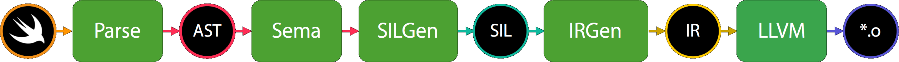
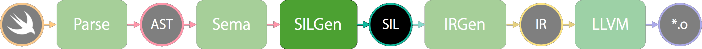

theme: Next, 8
footer: SIL for First Time Learners, Yusuke Kita (@kitasuke), try! Swift Tokyo 2018

# SIL for First Time Learners

---

# Hi, I'm Yusuke
## @kitasuke


---

# [fit] 　Why SIL?　

---
[.build-lists: true]

# Why SIL?
- Better idea of Swift type system
- Optimizations magic :crystal_ball::sparkles:
- Just for fun!

---

# [fit] 　　SIL　　

---

# [fit] Swift
# [fit] Intermediate
# [fit] Language

---

> **SIL is a language specific Intermediate Representation**

---

# [fit] Swift Compiler

---

# Swift Compiler
<br><br><br><br><br>


---

# Swift Compiler
<br><br><br><br><br>


---

# [fit] What *SIL* looks like?

---

# sample.swift

```swift
func number() -> Int {
    let x: Int
    x = 1
    return x
}
```

---

# Emit SIL

```bash
$swiftc -emit-sil sample.swift -o sample.sil
```

---

# sample.sil

```llvm
sil hidden @_T06sample6numberSiyF : $@convention(thin) () -> Int {
bb0:
    %0 = alloc_stack $Int, let, name "x"
    %1 = integer_literal $Builtin.Int64, 1
    %2 = struct $Int (%1 : $Builtin.Int64)
    store %2 to %0 : $*Int
    dealloc_stack %0 : $*Int
    return %2 : $Int
}
```

---

# Emit SIL with `-O`

```bash
$swiftc -emit-sil -O sample.swift -o sample.sil
```

---

# sample.sil with `-O`

```llvm
sil hidden @_T06sample6numberSiyF : $@convention(thin) () -> Int {
bb0:
    %0 = integer_literal $Builtin.Int64, 1
    %1 = struct $Int (%0 : $Builtin.Int64)
    return %1 : $Int
}
```

---

# sample.swift

```swift
func number() -> Int {
    let x: Int
    x = 1
    return x
}
```

---

# sample.swift

```swift
func number() -> Int {
    return 1
}
```

---


# Diff

```llvm, [.highlight: 3, 6-7]
sil hidden @_T06sample6numberSiyF : $@convention(thin) () -> Int {
bb0:
    %0 = alloc_stack $Int, let, name "x"
    %1 = integer_literal $Builtin.Int64, 1
    %2 = struct $Int (%1 : $Builtin.Int64)
    store %2 to %0 : $*Int
    dealloc_stack %0 : $*Int
    return %2 : $Int
}
```

---

# sample.sil with `-O`

```llvm
sil hidden @_T06sample6numberSiyF : $@convention(thin) () -> Int {
bb0:
    %0 = integer_literal $Builtin.Int64, 1
    %1 = struct $Int (%0 : $Builtin.Int64)
    return %1 : $Int
}
```

---

# [fit] Optimizations :crystal_ball::sparkles:

---

# Optimization flag
- `-Onone`
- `-O`
- `-Ounchecked`
- `-Osize` **New!**

---

[.build-lists: true]
# Summary

- Somehow understandable
- Better idea of how Swift Compiler works
- Definitely worth learning!

---

# References

- [swift/docs/SIL.rst](https://github.com/apple/swift/blob/master/docs/SIL.rst#sil-stage)
- [Swift's High-Level IR: A Case Study of Complementing LLVM IR with Language-Specific Optimization](https://www.youtube.com/watch?v=Ntj8ab-5cvE)

---

# Thank you!
