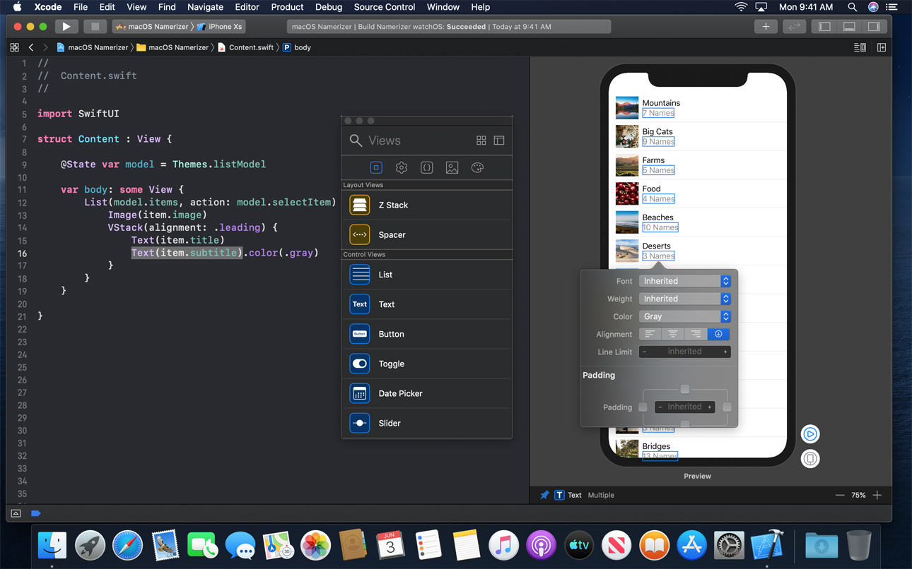
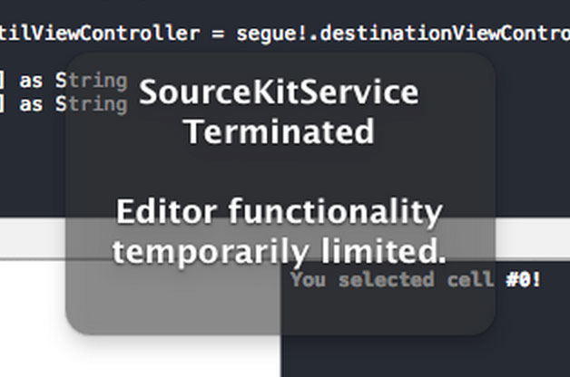
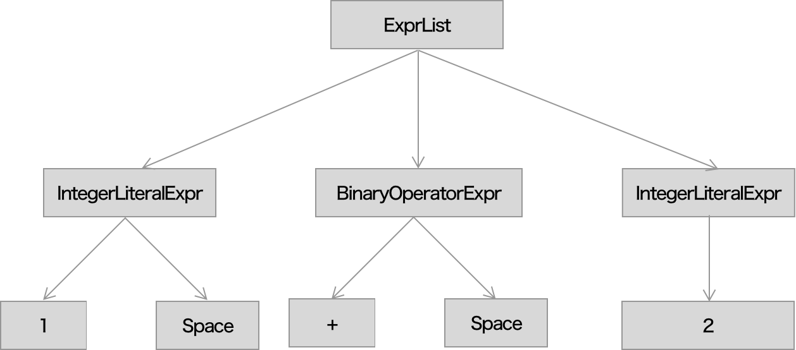
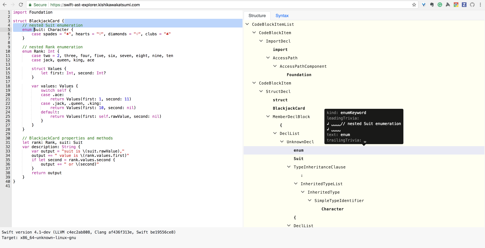

theme: Customized Fira Swift, 1
footer: Making your own tool using SwiftSyntax, Yusuke Kita (@kitasuke)

# [fit] Making your own tool<br> using **SwiftSyntax**

^
Hello everyone,
This is my second time /dev/world
and I'm happy to give a talk here again
Today, I'm going to talk about making your own tool using SwiftSyntax.
Have you ever heard about SwiftSyntax?

---

# Hi, I'm Yusuke
## @kitasuke


^
Hi, I'm Yusuke. my social account name is kitasuke
I work for Mercari as software engineer.
I'm a tiny contributor of Swift compiler, SwiftSyntax and swift-format

---

## [fit] App development<br>:iphone::computer::watch::tv:

^
We develop apps.
It could be iOS, macOS, watchOS or tvOS
There are mainly two things we often touch

---

# [fit] Source code :memo:

^
Source code. Most important part

---

# Tools :hammer:

^
And also tools. We use swiftlint, fastlane, Xcode. Can't do anything without those tools.
Tools are also very important

---

## Tools help make programming easier

^
Because tools help make programming easier.
These tools significantly make our source code better.

---

## Tools using **SwiftSyntax**

^
Before we dive into SwiftSyntax, let me introduce some tools using SwiftSyntax.
So that you can imagine what we can do with it

---

## SwiftUI Previews

^
SwiftUI Previews. You know SwiftUI, right?
Xcode 11 provides preview feature for SwiftUI

---

# SwiftUI Previews



^
Left side is source code and right side is previews.
One thing I like about SwiftUI is a single source of truth.
No storyboard or xibs anymore.
If you modify layout on previews, it's reflected in source code and same thing happens in the other way around.
In this part, source code is generated by SwiftSyntax on SwiftUI previews

---

## [swift-format](https://github.com/apple/swift-format)

### [SE-0250: Swift Code Style Guidelines and Formatter](https://forums.swift.org/t/se-0250-swift-code-style-guidelines-and-formatter/21795)

^
Next, swift-format. I don't think many of you've heard yet, because it's still under discussion.
swift-format will be an official formatter in the future.
If you're interested, see more details above the link

---

# swift-format

:white_check_mark:　　　　　　　　　　　　　　　　　　　　　　

```swift
let number: Int = 5
```

:no_entry:　　　　　　　　　　　　　　　　　　　　　　

```swift
let number:Int = 5
let number : Int = 5
```

^
You can think of swift-format same as swiftlint for now
It's a lint/format tool for Swift

---

## [SwiftConst](https://github.com/kitasuke/SwiftConst)

### Find in repeated strings that could be replaced by a constant

^
SwiftConst is an inspector tool to find in repeating strings developed by me.
Be aware that it's still beta version.
I'll extend the tool to find in other repeating things like function in the future.

---

## SwiftConst

```sh
$ swiftconst run
other occurrence(s) of "error" found in: main.swift:7:11
other occurrence(s) of "help" found in: main.swift:18:19
other occurrence(s) of "error" found in: main.swift:19:28
other occurrence(s) of "help" found in: main.swift:21:19
```

^
This's an output on terminal when you run SwiftConst
As you can see, raw strings "error" and "help" are used multiple times in different place.
In this case, it's better to have them as constants

---

# [fit] **[SwiftSyntax](https://github.com/apple/swift-syntax)**

^
I believe that you already saw the power of SwiftSyntax.
It's a great tool for Swift tools.

---



---

## What's **SwiftSyntax** for?

^
There are more tools using SwiftSyntax, but there's almost two things we can do

---

# [fit] Code modifier

^
Code formatter/code generator
SwiftSyntax allows to change or even generate new source code

---

# Code analyzer

^
Code linter/code inspector
SwiftSyntax allows to analyze source code

---

## What's **SwiftSyntax**?

^
We covered what SwiftSyntax is for. Let's move on to what SwiftSyntax is.

---

> SwiftSyntax is a set of Swift bindings for the libSyntax library. It allows for Swift tools to parse, inspect, generate, and transform Swift source code.

^
it's Swift bindings for libSyntax

---

# **[libSyntax](https://github.com/apple/swift/tree/master/lib/Syntax)**

^
so next question, what's libSyntax?

---

> libSyntax library aims to represent the syntax tree of the source file

^
libSyntax creates syntax tree of Swift source code

---

# **Syntax Tree**

^
I guess you know how syntax tree looks like

---

# `1 + 2`



^
Here is an example of syntax tree for `1 + 2` in source file.
Actual syntax tree has more contexts
ExprList has three expressions, IntegerLiteralExpr and BinaryOperatorExpr.
Int value for integerLiteralExpr and operator for BinaryOperatorExpr
This's what we call syntax tree

---

## **SwiftSyntax** parses<br> **Swift** source code to syntax tree

^
Simplified version of what SwiftSyntax does is SwiftSyntax parses Swift source code to syntax tree.

---

## How to emit syntax tree

^
Let's emit syntax tree.
You can do this by using swift command

---

# `$ swift -frontend emit-syntax`

Parse input file(s) and emit the Syntax tree(s) as JSON

^
There is emit-syntax option which parses input file and emit syntax tree as JSON

---

# `$ swift -frontend emit-syntax`

```
// 1 + 2
- SourceFile
    - CodeBlockItemList
        - CodeBlockItem
            - SequenceExpr
                - ExprList
                    - IntegerLiteralExpr
                        - integer_literal: 1
                        - trailingTrivia: Space
                    - BinaryOperatorExpr
                        - oper_binary_spaced: +
                        - trailingTrivia: Space
                    - IntegerLiteralExpr
                        - integer_literal: 2
```

^
Here is an output for 1 + 2 as an input
You can see structure of source file.
SourceFile at the top level, CodeBlock, SequenceExpr, IntegerLiteralExpr or BinaryOperatorExpr.
If you're curious about other syntaxes, give it a try with your input later.

---

## [Swift AST Explorer](https://swift-ast-explorer.kishikawakatsumi.com)

### Swift AST to HTML conversion

^
I would like to share a great tool to show syntax tree in a better way.
Most of cases, JSON output is too long to read
This tool called Swift AST Explorer gives you HTML output instead so that you can check easily on your browser.

---

# Swift AST Explorer



^
Left side is input as Swift source code and right side is output as syntax tree.
You can see syntax one by one by moving cursor on each syntax.
This is a must-have tool when you develop tools using SwiftSyntax.
I personally often use to look up what syntax we have by giving various Swift source code.

---

# Recap

[.build-lists]
- SwiftSyntax is a parsing tool
- Emits syntax tree
- Allows to inspect and transform source code

^
Let's recap.
- SwiftSyntax is a parsing tool for Swift tool
- and emits syntax tree
- It allows Swift tools to inspect and transform source code
Source code is like a giant string value.
We can't distinguish whether it's function or variable easily without syntax info.
That's why we need SwiftSyntax

---

## How **SwiftSyntax** works?

^
Alright, let's move on how it works

---

## Usage via SwiftPM

^
SwiftSyntax is available via SwiftPM

---

# `Package.swift`

```swift
import PackageDescription

let package = Package(
  name: "MyTool",
  dependencies: [
    .package(url: "https://github.com/apple/swift-syntax.git",
      .exact("<#Specify Release tag#>")),
  ],
  targets: [
    .target(name: "MyTool", dependencies: ["SwiftSyntax"]),
  ]
)
```

^
In package.swift, you can specify swift syntax as dependency.
I strongly recommend to use release tag.

---

# Interfaces

^
I'll briefly show you some interfaces for integer literal case

---

# `SyntaxParser`

### Parsing Swift source

^
First, SyntaxParser
You need to parse Swift source file to syntax tree.
SyntaxParser literally is an interface for that

---

# `SyntaxParser`

```swift
/// Parses the file `URL` into a full-fidelity Syntax tree.
///
/// - Parameters:
///   - url: The file URL to parse.
///   - diagnosticEngine: Optional diagnostic engine to where the parser will
///       emit diagnostics
/// - Returns: A top-level Syntax node representing the contents of the tree,
///            if the parse was successful.
/// - Throws: `ParserError`
public static func parse(_ url: URL,
    diagnosticEngine: DiagnosticEngine? = nil) throws -> SourceFileSyntax
```

^
Call this function with url of source file so that you could get syntax tree which is called SourceFileSyntax
You can also pass diagnostic engine

---

# `SourceFileSyntax`

### Structure of source file

^
SourceFileSyntax represents structure of source file
And it's a top level syntax node in syntax tree

---

# `SourceFileSyntax`

```swift
// 1 + 2 in sample.swift
- SourceFileSyntax
    - CodeBlockItemListSyntax
        - CodeBlockItemSyntax
            - SequenceExprSyntax
                - ExprListSyntax
                    - IntegerLiteralExprSyntax
                        - integerLiteral: 1
                        - trailingTrivia: Space
                    - BinaryOperatorExprSyntax
                        - spacedBinaryOperator: +
                        - trailingTrivia: Space
                    - IntegerLiteralExprSyntax
                        - integerLiteral: 2
```

^
Same example again
Here is SourceFileSyntax of the file
From the top, source file has code blocks, which have sequence expressions like 1 + 2 for this case
Each syntax can have trivia info which is like how many spaces, lines or comments
With this, you can analyze very deeply

---

# `Syntax`

^
As you can see, there are many syntaxes defined
Let's dig into integer literal syntax

---

# `IntegerLiteralExprSyntax`

```swift
public struct IntegerLiteralExprSyntax:
  ExprSyntax, _SyntaxBase, Hashable {
  enum Cursor: Int {
    case digits
  }

  public var digits: TokenSyntax {...}
  ...
}
```

^
It's struct and has a digits property of TokenSyntax.

---

# `TokenSyntax`

```swift
/// A Syntax node representing a single token.
public struct TokenSyntax: _SyntaxBase, Hashable {
  /// The text of the token as written in the source code.
  public var text: String {
    return tokenKind.text
  }
  ...
}
```

^
It's a syntax node representing a single token.
It has a text property which contains the text of the token as written in the source code.
which means you can get raw value of each token by accessing this property.
For integerLiteralExpr case, you can get integer as String

---

# Syntaxes

`IdentifierExprSyntax`, `ArrayExprSyntax`, `DictionaryExprSyntax`, `IntegerLiteralExprSyntax`, `BooleanLiteralExprSyntax`, `FunctionCallExprSyntax`, `StringLiteralExprSyntax`, `ClassDeclSyntax`, `StructDeclSyntax`, `ProtocolDeclSyntax`, `VariableDeclSyntax`, `EnumDeclSyntax`, `SwitchStmtSyntax`, `IfStmtSyntax` ...

^
There are more syntaxes as well.
IdentifierExprSyntax ...
You don't need to deal with all of them for most of cases.

---

# `SyntaxVisitor`

### Visiting each syntax

^
SyntaxVisitor provides a way to visit each syntax

---

# `SyntaxVisitor`

```swift
/// Visiting `IntegerLiteralExprSyntax` specifically.
///   - Parameter node: the node we are visiting.
///   - Returns: how should we continue visiting.
mutating func visit(_ node: IntegerLiteralExprSyntax) -> SyntaxVisitorContinueKind {
  return .visitChildren
}

/// The function called after visiting `IntegerLiteralExprSyntax` and its descendents.
///   - node: the node we just finished visiting.
mutating func visitPost(_ node: IntegerLiteralExprSyntax) {}
```

^
Here is visitor functions for IntegerLiteralExprSyntax.
One is for visiting.
It visits from the top to bottom in the tree.
You can return whether it should continue to visit children or skip them.
Another is after visiting.
These are places where you can inspect something for specific syntax.

---

# `SyntaxRewriter`

### Rewriting each syntax

^
Next SyntaxRewriter.
It provides a way to rewrite each syntax

---

# `SyntaxRewriter`

```swift
open func visit(_ node: IntegerLiteralExprSyntax) -> ExprSyntax {
  return visitChildren(node) as! ExprSyntax
}
```

^
Here is a visitor function for IntegerLiteralExprSyntax.
You can return whatever syntax you want as IntegerLiteralExprSyntax.
It can be existing, modified, or totally new one.
This is a place where you can transform syntax.

---

# `SyntaxFactory`

### Make each syntax

^
SyntaxFactory provides convenience factory methods to make a syntax.

---

# `SyntaxFactory`

```swift
public static func makeIntegerLiteralExpr(digits: TokenSyntax)
  -> IntegerLiteralExprSyntax {
  let layout: [RawSyntax?] = [
    digits.raw,
  ]
  let raw = RawSyntax.createAndCalcLength(
    kind: .integerLiteralExpr,
    layout: layout,
    presence: .present
  )
  let data = SyntaxData.forRoot(raw)
  return IntegerLiteralExprSyntax(data)
}
```

^
This is factory method for IntegerLiteralExprSyntax.
It takes digits as an argument and return IntegerLiteralExprSyntax.
This convenience function does complicated syntax creation for you.
As long as you use this method, you don't need to deal with RawSyntax or SyntaxData.

---

# Usecases

^
Alright, that's almost everything you have to know for details.
I'll showcase how you actually make your own tool with SwiftSyntax.

---

# [fit] Odd number inspector :vertical_traffic_light:

^
Odd number inspector
It's a light weight linter

---

## Odd number inspector

```swift
// Use even instead, not odd
view.frame.height = 43
```

^
This tool tells you to use even number, instead of odd number for UI code
To do so, we need to visit IntegerLiteralExprSyntax to see if odd number is used or not

---

# `OddNumberInspector`

[.code-highlight: 1, 10]
```swift
struct OddNumberInspector: SyntaxVisitor {
    mutating func visitPost(_ node: IntegerLiteralExprSyntax) {
        // do nothing if it's even
        guard let integer = Int(node.digits.text),
            integer % 2 == 1 else {
            return
        }
        print("Use even instead, not odd")
    }
}
```

^
SyntaxVisitor works for this case

---

# `OddNumberInspector`

[.code-highlight: 1-2, 9-10]
```swift
struct OddNumberInspector: SyntaxVisitor {
    mutating func visitPost(_ node: IntegerLiteralExprSyntax) {
        // do nothing if it's even
        guard let integer = Int(node.digits.text),
            integer % 2 == 1 else {
            return
        }
        print("Use even instead, not odd")
    }
}
```

^
visitPost allows us to visit IntegerLiteralExprSyntax

---

# `OddNumberInspector`

```swift
struct OddNumberInspector: SyntaxVisitor {
    mutating func visitPost(_ node: IntegerLiteralExprSyntax) {
        // do nothing if it's even
        guard let integer = Int(node.digits.text),
            integer % 2 == 1 else {
            return
        }
        print("Use even instead, not odd")
    }
}
```

^
We can get actual int value as String by accessing node.digits.text
And check whether it's even
If it's odd, it just prints warning

---

# main.swift

[.code-highlight: 1-2]
```swift
// parse Swift source to get SourceFileSyntax
let sourceFile = try SyntaxParser.parse(pathURL)

// walk SourceFileSyntax with visitor
var visitor = OddNumberInspector()
sourceFile.walk(&visitor)
```

^
Since this is a command line tool, you have main.swift file
Parse Swift source to get SourceFileSyntax

---


# main.swift

```swift
// parse Swift source to get SourceFileSyntax
let sourceFile = try SyntaxParser.parse(pathURL)

// walk SourceFileSyntax with visitor
var visitor = OddNumberInspector()
sourceFile.walk(&visitor)
```

^
Then walk them with the visitor we defined
That's it!

---

## Odd number inspector

```swift
// Use even instead, not odd
view.frame.height = 43
```

^
If you run the tool on your terminal, you can see warning.

---

# [fit] Ten multiplication formatter :muscle:

^
Next, code formatter
It's a light weight formatter

---

## Ten multiplication formatter

```swift
let i: Int = 1 // -> 10
```

^
This tool formats int value to multiply by 10
To do so, we need to rewrite IntegerLiteralExprSyntax


---

# TenMultiplicationFormatter

[.code-highlight: 1, 16]
```swift
class TenMultiplicationFormatter: SyntaxRewriter {
    override func visit(_ node: IntegerLiteralExprSyntax) -> ExprSyntax {
        guard let integer = Int(node.digits.text) else {
            return node
        }

        let digits = SyntaxFactory.makeIntegerLiteral(
            String(integer * 10),
            leadingTrivia: node.leadingTrivia ?? .zero,
            trailingTrivia: node.trailingTrivia ?? .zero
        )
        return IntegerLiteralExprSyntax {
            $0.useDigits(digits)
        }
    }
}
```

^
SyntaxRewriter works for this case

---

# TenMultiplicationFormatter

[.code-highlight: 1-2, 15-16]
```swift
class TenMultiplicationFormatter: SyntaxRewriter {
    override func visit(_ node: IntegerLiteralExprSyntax) -> ExprSyntax {
        guard let integer = Int(node.digits.text) else {
            return node
        }

        let digits = SyntaxFactory.makeIntegerLiteral(
            String(integer * 10),
            leadingTrivia: node.leadingTrivia ?? .zero,
            trailingTrivia: node.trailingTrivia ?? .zero
        )
        return IntegerLiteralExprSyntax {
            $0.useDigits(digits)
        }
    }
}
```

^
visit function allows to rewrite IntegerLiteralExprSyntax

---

# TenMultiplicationFormatter

[.code-highlight: 1-11, 15-16]
```swift
class TenMultiplicationFormatter: SyntaxRewriter {
    override func visit(_ node: IntegerLiteralExprSyntax) -> ExprSyntax {
        guard let integer = Int(node.digits.text) else {
            return node
        }

        let digits = SyntaxFactory.makeIntegerLiteral(
            String(integer * 10),
            leadingTrivia: node.leadingTrivia ?? .zero,
            trailingTrivia: node.trailingTrivia ?? .zero
        )
        return IntegerLiteralExprSyntax {
            $0.useDigits(digits)
        }
    }
}
```

^
Use SyntaxFactory to make syntax node for integer literal
Don't forget to multiply by 10 before passing integer to the factory method

---

# TenMultiplicationFormatter

```swift
class TenMultiplicationFormatter: SyntaxRewriter {
    override func visit(_ node: IntegerLiteralExprSyntax) -> ExprSyntax {
        guard let integer = Int(node.digits.text) else {
            return node
        }

        let digits = SyntaxFactory.makeIntegerLiteral(
            String(integer * 10),
            leadingTrivia: node.leadingTrivia ?? .zero,
            trailingTrivia: node.trailingTrivia ?? .zero
        )
        return IntegerLiteralExprSyntax {
            $0.useDigits(digits)
        }
    }
}
```

^
Then create a new IntegerLiteralExprSyntax with the digits,
So that this tool can format your Swift source code

---

# main.swift

[.code-highlight: 1-2]
```swift
// parse Swift source to get SourceFileSyntax
let sourceFile = try SyntaxParser.parse(pathURL)

// visit SourceFileSyntax
var visitor = TenMultiplicationFormatter()
let modifiedSourceFile = TenMultiplicationFormatter().visit(sourceFile)
```

^
Again, parse Swift source to get syntax

---

# main.swift

```swift
// parse Swift source to get SourceFileSyntax
let sourceFile = try SyntaxParser.parse(pathURL)

// visit SourceFileSyntax
var visitor = TenMultiplicationFormatter()
let modifiedSourceFile = TenMultiplicationFormatter().visit(sourceFile)
```

^
Then visit them with the visitor we defined

---

## Ten multiplication formatter

```swift
let i: Int = 10 // <- 1
```

^
If you run the tool on your terminal, it's formatted to above code
That's all about formatter

---

## Tools make your code much better :sunglasses:

^
Those are just examples.
You can make more practical tools for you project.
These definitely make your source code much better.

---

## Tools sometimes are better corder than you :laughing:

^
You have to admit that tools sometimes are better corder than you.
Don't overestimate you, let the tools work for you.

---

# Improvements

- [Speeding up SwiftSyntax by using the parser directly](https://forums.swift.org/t/speeding-up-swiftsyntax-by-using-the-parser-directly/18493)
- [Integrating libSyntax into the compiler pipeline](https://forums.swift.org/t/integrating-libsyntax-into-the-compiler-pipeline/26605)
- [Declarative syntax creation using function builders](https://github.com/apple/swift-syntax/pull/139)

^
Before ending my talk, I would like to mention about some big improvements in SwiftSyntax.
These will speed up and provide more expressive way

---

# Summary

[.build-lists]
- Take benefit of statically typed language
- Useful tools make better apps
- SwiftSyntax's improving significantly

^
Swift is statically typed language.
You should take a benefit by using static analysis tools.
Useful tools make better apps.
I think making a tool would be a great investment.
SwiftSyntax might be slow than you expected,
but it's getting better

---

# References

- [https://github.com/apple/swift-syntax](https://github.com/apple/swift-syntax)
- [https://www.slideshare.net/kitasuke/integrating-libsyntax-into-the-compiler-pipeline](https://www.slideshare.net/kitasuke/integrating-libsyntax-into-the-compiler-pipeline)

---

## Thank you!
