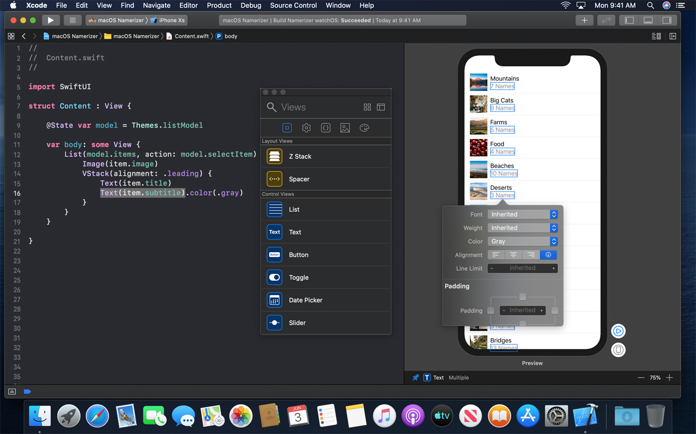

theme: Customized Fira Swift, 1
footer: Making your own tool using SwiftSyntax, Yusuke Kita (@kitasuke)

# [fit] Making your own tool<br> using **SwiftSyntax**

---

# Hi, I'm Yusuke
## @kitasuke


---

## [fit] App development<br>:iphone::computer::watch::tv:

---

# [fit] Source code :memo:

---

# Tools :hammer:

---

## Tools help make programming easier

---

## Tools using **SwiftSyntax**

---

## SwiftUI Previews

---

# SwiftUI Previews



---

## [swift-format](https://github.com/apple/swift-format)

### [SE-0250: Swift Code Style Guidelines and Formatter](https://forums.swift.org/t/se-0250-swift-code-style-guidelines-and-formatter/21795)

---

# swift-format

:white_check_mark:　　　　　　　　　　　　　　　　　　　　　　

```swift
let number: Int = 5
```

:no_entry:　　　　　　　　　　　　　　　　　　　　　　

```swift
let number:Int = 5
let number : Int = 5
```

---

## [SwiftConst](https://github.com/kitasuke/SwiftConst)

### Find in repeated strings that could be replaced by a constant

---

## SwiftConst

```sh
$ swiftconst run
other occurrence(s) of "error" found in: main.swift:7:11
other occurrence(s) of "help" found in: main.swift:18:19
other occurrence(s) of "error" found in: main.swift:19:28
other occurrence(s) of "help" found in: main.swift:21:19
```

---

# [fit] **[SwiftSyntax](https://github.com/apple/swift-syntax)**

---


---

## What's **SwiftSyntax** for?

---

# [fit] Code modifier

---

# Code analyzer

---

## What's **SwiftSyntax**?

---

> SwiftSyntax is a set of Swift bindings for the libSyntax library. It allows for Swift tools to parse, inspect, generate, and transform Swift source code.

---

# **[libSyntax](https://github.com/apple/swift/tree/master/lib/Syntax)**

---

> libSyntax library aims to represent the syntax tree of the source file

---

# **Syntax Tree**

---

# `1 + 2`


---

## **SwiftSyntax** parses<br> **Swift** source code to syntax tree

---

## How to emit syntax tree

---

# `$ swift -frontend emit-syntax`

Parse input file(s) and emit the Syntax tree(s) as JSON

---

# `$ swift -frontend emit-syntax`

```
// 1 + 2
- SourceFile
    - CodeBlockItemList
        - CodeBlockItem
            - SequenceExpr
                - ExprList
                    - IntegerLiteralExpr
                        - integer_literal: 1
                        - trailingTrivia: Space
                    - BinaryOperatorExpr
                        - oper_binary_spaced: +
                        - trailingTrivia: Space
                    - IntegerLiteralExpr
                        - integer_literal: 2
```

---

## [Swift AST Explorer](https://swift-ast-explorer.kishikawakatsumi.com)

### Swift AST to HTML conversion

---

# Swift AST Explorer


---

# Recap

[.build-lists]
- SwiftSyntax is a parsing tool
- Emits syntax tree
- Allows to inspect and transform source code

---

## How **SwiftSyntax** works?

---

## Usage via SwiftPM

---

# `Package.swift`

```swift
import PackageDescription

let package = Package(
  name: "MyTool",
  dependencies: [
    .package(url: "https://github.com/apple/swift-syntax.git",
      .exact("<#Specify Release tag#>")),
  ],
  targets: [
    .target(name: "MyTool", dependencies: ["SwiftSyntax"]),
  ]
)
```

---

# Interfaces

---

# `SyntaxParser`

### Parsing Swift source

---

# `SyntaxParser`

```swift
/// Parses the file `URL` into a full-fidelity Syntax tree.
///
/// - Parameters:
///   - url: The file URL to parse.
///   - diagnosticEngine: Optional diagnostic engine to where the parser will
///       emit diagnostics
/// - Returns: A top-level Syntax node representing the contents of the tree,
///            if the parse was successful.
/// - Throws: `ParserError`
public static func parse(_ url: URL,
    diagnosticEngine: DiagnosticEngine? = nil) throws -> SourceFileSyntax
```

---

# `SourceFileSyntax`

### Structure of source file

---

# `SourceFileSyntax`

```swift
// 1 + 2 in sample.swift
- SourceFileSyntax
    - CodeBlockItemListSyntax
        - CodeBlockItemSyntax
            - SequenceExprSyntax
                - ExprListSyntax
                    - IntegerLiteralExprSyntax
                        - integerLiteral: 1
                        - trailingTrivia: Space
                    - BinaryOperatorExprSyntax
                        - spacedBinaryOperator: +
                        - trailingTrivia: Space
                    - IntegerLiteralExprSyntax
                        - integerLiteral: 2
```

---

# `Syntax`

---

# `IntegerLiteralExprSyntax`

```swift
public struct IntegerLiteralExprSyntax:
  ExprSyntax, _SyntaxBase, Hashable {
  enum Cursor: Int {
    case digits
  }

  public var digits: TokenSyntax {...}
  ...
}
```

---

# `TokenSyntax`

```swift
/// A Syntax node representing a single token.
public struct TokenSyntax: _SyntaxBase, Hashable {
  /// The text of the token as written in the source code.
  public var text: String {
    return tokenKind.text
  }
  ...
}
```

---

# Syntaxes

`IdentifierExprSyntax`, `ArrayExprSyntax`, `DictionaryExprSyntax`, `IntegerLiteralExprSyntax`, `BooleanLiteralExprSyntax`, `FunctionCallExprSyntax`, `StringLiteralExprSyntax`, `ClassDeclSyntax`, `StructDeclSyntax`, `ProtocolDeclSyntax`, `VariableDeclSyntax`, `EnumDeclSyntax`, `SwitchStmtSyntax`, `IfStmtSyntax` ...

---

# `SyntaxVisitor`

### Visiting each syntax

---

# `SyntaxVisitor`

```swift
/// Visiting `IntegerLiteralExprSyntax` specifically.
///   - Parameter node: the node we are visiting.
///   - Returns: how should we continue visiting.
mutating func visit(_ node: IntegerLiteralExprSyntax) -> SyntaxVisitorContinueKind {
  return .visitChildren
}

/// The function called after visiting `IntegerLiteralExprSyntax` and its descendents.
///   - node: the node we just finished visiting.
mutating func visitPost(_ node: IntegerLiteralExprSyntax) {}
```

---

# `SyntaxRewriter`

### Rewriting each syntax

---

# `SyntaxRewriter`

```swift
open func visit(_ node: IntegerLiteralExprSyntax) -> ExprSyntax {
  return visitChildren(node) as! ExprSyntax
}
```

---

# `SyntaxFactory`

### Make each syntax

---

# `SyntaxFactory`

```swift
public static func makeIntegerLiteralExpr(digits: TokenSyntax)
  -> IntegerLiteralExprSyntax {
  let layout: [RawSyntax?] = [
    digits.raw,
  ]
  let raw = RawSyntax.createAndCalcLength(
    kind: .integerLiteralExpr,
    layout: layout,
    presence: .present
  )
  let data = SyntaxData.forRoot(raw)
  return IntegerLiteralExprSyntax(data)
}
```

---

# Usecases

---

# [fit] Odd number inspector :vertical_traffic_light:

---

## Odd number inspector

```swift
// Use even instead, not odd
view.frame.height = 43
```

---

# `OddNumberInspector`

[.code-highlight: 1, 10]
```swift
struct OddNumberInspector: SyntaxVisitor {
    mutating func visitPost(_ node: IntegerLiteralExprSyntax) {
        // do nothing if it's even
        guard let integer = Int(node.digits.text),
            integer % 2 == 1 else {
            return
        }
        print("Use even instead, not odd")
    }
}
```

---

# `OddNumberInspector`

[.code-highlight: 1-2, 9-10]
```swift
struct OddNumberInspector: SyntaxVisitor {
    mutating func visitPost(_ node: IntegerLiteralExprSyntax) {
        // do nothing if it's even
        guard let integer = Int(node.digits.text),
            integer % 2 == 1 else {
            return
        }
        print("Use even instead, not odd")
    }
}
```

---

# `OddNumberInspector`

```swift
struct OddNumberInspector: SyntaxVisitor {
    mutating func visitPost(_ node: IntegerLiteralExprSyntax) {
        // do nothing if it's even
        guard let integer = Int(node.digits.text),
            integer % 2 == 1 else {
            return
        }
        print("Use even instead, not odd")
    }
}
```

---

# main.swift

[.code-highlight: 1-2]
```swift
// parse Swift source to get SourceFileSyntax
let sourceFile = try SyntaxParser.parse(pathURL)

// walk SourceFileSyntax with visitor
var visitor = OddNumberInspector()
sourceFile.walk(&visitor)
```

---


# main.swift

```swift
// parse Swift source to get SourceFileSyntax
let sourceFile = try SyntaxParser.parse(pathURL)

// walk SourceFileSyntax with visitor
var visitor = OddNumberInspector()
sourceFile.walk(&visitor)
```

---

## Odd number inspector

```swift
// Use even instead, not odd
view.frame.height = 43
```

---

# [fit] Ten multiplication formatter :muscle:

---

## Ten multiplication formatter

```swift
let i: Int = 1 // -> 10
```

---

# TenMultiplicationFormatter

[.code-highlight: 1, 16]
```swift
class TenMultiplicationFormatter: SyntaxRewriter {
    override func visit(_ node: IntegerLiteralExprSyntax) -> ExprSyntax {
        guard let integer = Int(node.digits.text) else {
            return node
        }

        let digits = SyntaxFactory.makeIntegerLiteral(
            String(integer * 10),
            leadingTrivia: node.leadingTrivia ?? .zero,
            trailingTrivia: node.trailingTrivia ?? .zero
        )
        return IntegerLiteralExprSyntax {
            $0.useDigits(digits)
        }
    }
}
```

---

# TenMultiplicationFormatter

[.code-highlight: 1-2, 15-16]
```swift
class TenMultiplicationFormatter: SyntaxRewriter {
    override func visit(_ node: IntegerLiteralExprSyntax) -> ExprSyntax {
        guard let integer = Int(node.digits.text) else {
            return node
        }

        let digits = SyntaxFactory.makeIntegerLiteral(
            String(integer * 10),
            leadingTrivia: node.leadingTrivia ?? .zero,
            trailingTrivia: node.trailingTrivia ?? .zero
        )
        return IntegerLiteralExprSyntax {
            $0.useDigits(digits)
        }
    }
}
```

---

# TenMultiplicationFormatter

[.code-highlight: 1-11, 15-16]
```swift
class TenMultiplicationFormatter: SyntaxRewriter {
    override func visit(_ node: IntegerLiteralExprSyntax) -> ExprSyntax {
        guard let integer = Int(node.digits.text) else {
            return node
        }

        let digits = SyntaxFactory.makeIntegerLiteral(
            String(integer * 10),
            leadingTrivia: node.leadingTrivia ?? .zero,
            trailingTrivia: node.trailingTrivia ?? .zero
        )
        return IntegerLiteralExprSyntax {
            $0.useDigits(digits)
        }
    }
}
```

---

# TenMultiplicationFormatter

```swift
class TenMultiplicationFormatter: SyntaxRewriter {
    override func visit(_ node: IntegerLiteralExprSyntax) -> ExprSyntax {
        guard let integer = Int(node.digits.text) else {
            return node
        }

        let digits = SyntaxFactory.makeIntegerLiteral(
            String(integer * 10),
            leadingTrivia: node.leadingTrivia ?? .zero,
            trailingTrivia: node.trailingTrivia ?? .zero
        )
        return IntegerLiteralExprSyntax {
            $0.useDigits(digits)
        }
    }
}
```

---

# main.swift

[.code-highlight: 1-2]
```swift
// parse Swift source to get SourceFileSyntax
let sourceFile = try SyntaxParser.parse(pathURL)

// visit SourceFileSyntax
var visitor = TenMultiplicationFormatter()
let modifiedSourceFile = TenMultiplicationFormatter().visit(sourceFile)
```

---

# main.swift

```swift
// parse Swift source to get SourceFileSyntax
let sourceFile = try SyntaxParser.parse(pathURL)

// visit SourceFileSyntax
var visitor = TenMultiplicationFormatter()
let modifiedSourceFile = TenMultiplicationFormatter().visit(sourceFile)
```

---

## Ten multiplication formatter

```swift
let i: Int = 10 // <- 1
```

---

## Tools make your code much better :sunglasses:

---

## Tools sometimes are better corder than you :laughing:

---

# Improvements

- [Speeding up SwiftSyntax by using the parser directly](https://forums.swift.org/t/speeding-up-swiftsyntax-by-using-the-parser-directly/18493)
- [Integrating libSyntax into the compiler pipeline](https://forums.swift.org/t/integrating-libsyntax-into-the-compiler-pipeline/26605)
- [Declarative syntax creation using function builders](https://github.com/apple/swift-syntax/pull/139)

---

# Summary

[.build-lists]
- Take benefit of statically typed language
- Useful tools make better apps
- SwiftSyntax's improving significantly

---

# References

- [https://github.com/apple/swift-syntax](https://github.com/apple/swift-syntax)
- [https://www.slideshare.net/kitasuke/integrating-libsyntax-into-the-compiler-pipeline](https://www.slideshare.net/kitasuke/integrating-libsyntax-into-the-compiler-pipeline)

---

## Thank you!
