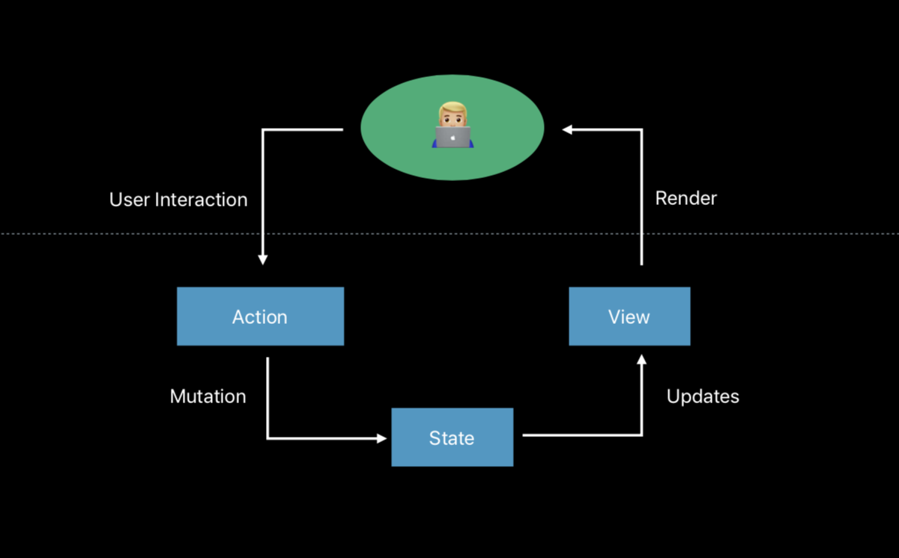
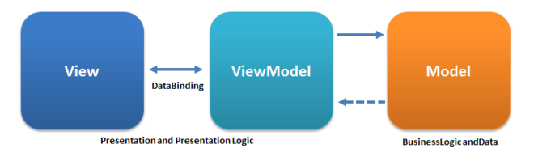

## Unidirectional Data Flow Through **SwiftUI**

### @kitasuke

---

# 

---

# 

---

# [fit]  ≠  + 

---

## [fit] SwiftUI ≈ React

---

## [fit] ~~SwiftUI ≈ React~~

---

## [fit] SwiftUI ≈ React + **MobX**

---

# 

---

# MobX

### *Simple, scalable state management*

---

# 

---

# 

---

# Redux

### *A predictable state container*

---

# ReSwift

### *Unidirectional Data Flow in Swift - Inspired by Redux*

---

# 

---

# 

---

# Flux

### *Application architecture for building user interfaces*

---

# 

---

# MVVM

---



---

## Why do we need these design patterns?

---

# *Unidirectional data flow*

---
[.build-lists: true]

# Unidirectional data flow

- Decoupled
- Testable
- Scalable

---

## What patterns can we adopt with **SwiftUI**?

---

# [fit] SwiftUI + **Flux**

---

## View

[.code-highlight: 1, 3-6, 10-13]
```swift
struct RepositoryListView : View {
    @ObjectBinding var store: RepositoryListStore = .shared
    private var actionCreator: RepositoryListActionCreator

    var body: some View {
        NavigationView {
            List(store.repositories) { repository in
                RepositoryListRow(repository: repository)
            }
        }
        .onAppear(perform: { self.actionCreator.onAppear() })
    }
}
```

---

## ActionCreator

[.code-highlight: 1, 3, 14-17]
```swift
final class RepositoryListActionCreator {
    private let dispatcher: RepositoryListDispatcher
    private let onAppearSubject = PassthroughSubject<Void, Never>()

    init(dispatcher: RepositoryListDispatcher = .shared) {
        _ = onAppearSubject
            .map { ... }
            .sink(receiveValue: { [dispatcher] in
                // dispatch action
                dispatcher.dispatch(.updateRepositories($0))
            })
    }

    func onAppear() {
        onAppearSubject.send(())
    }
}
```

---

## ActionCreator

[.code-highlight: 1-3, 5-12]
```swift
final class RepositoryListActionCreator {
    private let dispatcher: RepositoryListDispatcher
    private let onAppearSubject = PassthroughSubject<Void, Never>()

    init(dispatcher: RepositoryListDispatcher = .shared) {
        _ = onAppearSubject
            .map { ... }
            .sink(receiveValue: { [dispatcher] in
                // dispatch action
                dispatcher.dispatch(.updateRepositories($0))
            })
    }

    func onAppear() {
        onAppearSubject.send(())
    }
}
```

---

## ActionCreator

```swift
final class RepositoryListActionCreator {
    private let dispatcher: RepositoryListDispatcher
    private let onAppearSubject = PassthroughSubject<Void, Never>()

    init(dispatcher: RepositoryListDispatcher = .shared) {
        _ = onAppearSubject
            .map { ... }
            .sink(receiveValue: { [dispatcher] in
                // dispatch action
                dispatcher.dispatch(.updateRepositories($0))
            })
    }

    func onAppear() {
        onAppearSubject.send(())
    }
}
```

---

## Action

```swift
enum RepositoryListAction {
    case updateRepositories([Repository])
}
```

---

## Dispatcher

[.code-highlight: 1-4, 9-12]
```swift
final class RepositoryListDispatcher {
    static let shared = RepositoryListDispatcher()
    private let actionSubject = PassthroughSubject<RepositoryListAction, Never>()

    func register(callback: @escaping (RepositoryListAction) -> ()) {
        _ = actionSubject.sink(receiveValue: callback)
    }

    func dispatch(_ action: RepositoryListAction) {
        actionSubject.send(action)
    }
}
```

---

## Dispatcher

[.code-highlight: 1-7]
```swift
final class RepositoryListDispatcher {
    static let shared = RepositoryListDispatcher()
    private let actionSubject = PassthroughSubject<RepositoryListAction, Never>()

    func register(callback: @escaping (RepositoryListAction) -> ()) {
        _ = actionSubject.sink(receiveValue: callback)
    }

    func dispatch(_ action: RepositoryListAction) {
        actionSubject.send(action)
    }
}
```

---

## Dispatcher

```swift
final class RepositoryListDispatcher {
    static let shared = RepositoryListDispatcher()
    private let actionSubject = PassthroughSubject<RepositoryListAction, Never>()

    func register(callback: @escaping (RepositoryListAction) -> ()) {
        _ = actionSubject.sink(receiveValue: callback)
    }

    func dispatch(_ action: RepositoryListAction) {
        actionSubject.send(action)
    }
}
```

---

## Store

[.code-highlight: 1-2, 9-11, 14-18]
```swift
final class RepositoryListStore: BindableObject {
    static let shared = RepositoryListStore()
    let didChange = PassthroughSubject<Void, Never>()

    private(set) var repositories: [Repository] = [] {
        didSet { didChange.send(()) }
    }

    init(dispatcher: RepositoryListDispatcher = .shared) {
        dispatcher.register { [weak self] action in
            switch action {
            case .updateRepositories(let repositories):
                self?.repositories = repositories
            }
        }
    }
}
```

---

## Store

[.code-highlight: 1-8, 12-14]
```swift
final class RepositoryListStore: BindableObject {
    static let shared = RepositoryListStore()
    let didChange = PassthroughSubject<Void, Never>()

    private(set) var repositories: [Repository] = [] {
        didSet { didChange.send(()) }
    }

    init(dispatcher: RepositoryListDispatcher = .shared) {
        dispatcher.register { [weak self] action in
            switch action {
            case .updateRepositories(let repositories):
                self?.repositories = repositories
            }
        }
    }
}
```

---

## Store

```swift
final class RepositoryListStore: BindableObject {
    static let shared = RepositoryListStore()
    let didChange = PassthroughSubject<Void, Never>()

    private(set) var repositories: [Repository] = [] {
        didSet { didChange.send(()) }
    }

    init(dispatcher: RepositoryListDispatcher = .shared) {
        dispatcher.register { [weak self] action in
            switch action {
            case .updateRepositories(let repositories):
                self?.repositories = repositories
            }
        }
    }
}
```

---

## View

[.code-highlight: 1-2, 5-10, 12-13]
```swift
struct RepositoryListView : View {
    @ObjectBinding var store: RepositoryListStore = .shared
    private var actionCreator: RepositoryListActionCreator

    var body: some View {
        NavigationView {
            List(store.repositories) { repository in
                RepositoryListRow(repository: repository)
            }
        }
        .onAppear(perform: { self.actionCreator.onAppear() })
    }
}
```

---

## View

```swift
struct RepositoryListView : View {
    @ObjectBinding var store: RepositoryListStore = .shared
    private var actionCreator: RepositoryListActionCreator

    var body: some View {
        NavigationView {
            List(store.repositories) { repository in
                RepositoryListRow(repository: repository)
            }
        }
        .onAppear(perform: { self.actionCreator.onAppear() })
    }
}
```

---

# 

---

# [fit] SwiftUI + **MVVM**

---

## View

[.code-highlight: 1-5, 9-12]
```swift
struct RepositoryListView : View {
    @ObjectBinding var viewModel: RepositoryListViewModel

    var body: some View {
        NavigationView {
            List(viewModel.output.repositories) { repository in
                RepositoryListRow(repository: repository)
            }
        }
        .onAppear(perform: { self.viewModel.apply(.onAppear) })
    }
}
```

---

## UnidirectionalDataFlowType

[.code-highlight: 1-2, 5, 7]
```swift
protocol UnidirectionalDataFlowType {
    associatedtype InputType
    associatedtype OutputType

    func apply(_ input: InputType)
    var output: OutputType { get }
}
```

---

## UnidirectionalDataFlowType

[.code-highlight: 1, 3, 6-7]
```swift
protocol UnidirectionalDataFlowType {
    associatedtype InputType
    associatedtype OutputType

    func apply(_ input: InputType)
    var output: OutputType { get }
}
```

---

## UnidirectionalDataFlowType

```swift
protocol UnidirectionalDataFlowType {
    associatedtype InputType
    associatedtype OutputType

    func apply(_ input: InputType)
    var output: OutputType { get }
}
```

---

## ViewModel

```swift
final class RepositoryListViewModel:
    BindableObject, UnidirectionalDataFlowType {
    typealias InputType = Input

    enum Input {
        case onAppear
    }
    func apply(_ input: Input) {
        switch input {
        case .onAppear: onAppearSubject.send(())
        }
    }
    private let onAppearSubject = PassthroughSubject<Void, Never>()
    ...
}
```

---

## ViewModel

```swift
final class RepositoryListViewModel:
    BindableObject, UnidirectionalDataFlowType {
    typealias OutputType = Output

    struct Output {
        var repositories: [Repository] = []
    }
    private(set) var output = Output() {
        didSet {
            didChangeSubject.send(())
        }
    }
    ...
}
```

---

## ViewModel

```swift
final class RepositoryListViewModel:
    BindableObject, UnidirectionalDataFlowType {

    init() {
        let repositoriesStream = onAppearSubject
            .map { ... }
            .assign(to: \.output.repositories, on: self)
        ...
    }
}
```

---

## View

[.code-highlight: 1-9, 11-12]
```swift
struct RepositoryListView : View {
    @ObjectBinding var viewModel: RepositoryListViewModel

    var body: some View {
        NavigationView {
            List(viewModel.output.repositories) { repository in
                RepositoryListRow(repository: repository)
            }
        }
        .onAppear(perform: { self.viewModel.apply(.onAppear) })
    }
}
```

---

## View

```swift
struct RepositoryListView : View {
    @ObjectBinding var viewModel: RepositoryListViewModel

    var body: some View {
        NavigationView {
            List(viewModel.output.repositories) { repository in
                RepositoryListRow(repository: repository)
            }
        }
        .onAppear(perform: { self.viewModel.apply(.onAppear) })
    }
}
```

---


---

# [fit] SwiftUI + **Redux**

---

## View

[.code-highlight: 1, 3, 5-6, 10-14]
```swift
struct RepositoryListView : View {
    @ObjectBinding var state: RepositoryListState
    let reduxStore: ReduxStore

    var body: some View {
        NavigationView {
            List(state.repositories) { repository in
                RepositoryListRow(repository: repository)
            }
        }
        .onAppear(perform: {
            self.reduxStore.dispatch(RepositoryListAction.requestAsyncCreator())
        })
    }
}
```

---

## Action

```swift
enum RepositoryListAction: Action {
    case updateRepositories([Repository])

    static func requestAsyncCreator() -> RequestActionCreator {
        return { (_, store: DispatchingStoreType) in
            return ThunkAction(
                Future<Action, Never> { promise in
                    _ = APIService().searchRepository()
                        .map { RepositoryListAction.updateRepositories($0) }
                        .sink(receiveValue: { promise(.success($0)) })
                }
            )
        }
    }
}
```

---

## Reducer

```swift
struct RepositoryListReducer {
    static func reduce(action: Action,
        state: RepositoryListState) -> RepositoryListState {
        switch action {
        case let action as RepositoryListAction:
            switch action {
            case .updateRepositories(let repositories):
                state.repositories = repositories
            }
        default: break
        }
        return state
    }
}
```

---

## State

```swift
final class RepositoryListState: StateType, BindableObject {
    let didChange = PassthroughSubject<Void, Never>()

    var repositories: [Repository] = [] {
        didSet { didChange.send(()) }
    }
}
```

---

## View

[.code-highlight: 1-2, 5-10, 14-15]
```swift
struct RepositoryListView : View {
    @ObjectBinding var state: RepositoryListState
    let reduxStore: ReduxStore

    var body: some View {
        NavigationView {
            List(state.repositories) { repository in
                RepositoryListRow(repository: repository)
            }
        }
        .onAppear(perform: {
            self.reduxStore.dispatch(RepositoryListAction.requestAsyncCreator())
        })
    }
}
```

---

## View

```swift
struct RepositoryListView : View {
    @ObjectBinding var state: RepositoryListState
    let reduxStore: ReduxStore

    var body: some View {
        NavigationView {
            List(state.repositories) { repository in
                RepositoryListRow(repository: repository)
            }
        }
        .onAppear(perform: {
            self.reduxStore.dispatch(RepositoryListAction.requestAsyncCreator())
        })
    }
}
```

---

# 

---

## See more details

- [kitasuke/SwiftUI-Flux](https://github.com/kitasuke/SwiftUI-Flux)
- [kitasuke/SwiftUI-MVVM](https://github.com/kitasuke/SwiftUI-MVVM)
- [kitasuke/SwiftUI-Redux](https://github.com/kitasuke/SwiftUI-Redux)

---

# Takeaways

- Unidirectional data flow is simple, but robust
- SwiftUI provides nice APIs for data binding
- These design patterns are suitable for SwiftUI

---

## References

- [https://developer.apple.com/xcode/swiftui/](https://developer.apple.com/xcode/swiftui/)
- [https://mobx.js.org](https://mobx.js.org)
- [https://redux.js.org](https://redux.js.org)
- [https://github.com/ReSwift/ReSwift](https://github.com/ReSwift/ReSwift)
- [https://facebook.github.io/flux/](https://facebook.github.io/flux/)
