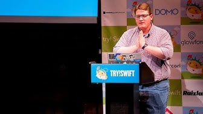

theme: Customized Fira Swift
footer: Contributing to Swift Compiler, Yusuke Kita (@kitasuke), try! Swift Tokyo 2019

## [fit] Contributing to  **Swift Compiler**

^
Today, I'm going to talk about how I contributed to swift compiler
and hope that you could get some ideas from my talk.

---

# Hi, I'm Yusuke
## @kitasuke

^
Working for Mercari
Frontend/Backend engineer

---

## How did I contribute?

^
Contributing to Swift Compiler sounds difficult, but less difficult than expected

---

## Community-Driven Contribution

^
community-driven contribution

---

# [fit] **Swift Community**

^
it's Swift Community
Share knowledge in community.
Place where take or give some ideas

---

# **try! Swift**

^
speaking of community,
try! Swift is huge community all over the world
many awesome talks and workshops

---

## **try! Swift**-Driven Contribution

^
In my case, try! Swift-driven contribution
can learn all about open source swift in the community
will tell you some examples

---

# :books: :memo:

^
First, we need inputs

---

# [fit] **Open Source Swift**

^
Let's take a look at overview of open source swift

---

# [Contributing to Open Source Swift](https://speakerdeck.com/jessesquires/contributing-to-open-source-swift)

- try! Swift Tokyo 2016

^
This talk was given by Jesse
about how swift compiler works and what process is to contribute
get basic ideas of swift compiler

---

# Swift Compiler
     

^
this is swift pipeline
many phases behind the scene
can also learn more details one by one

---

# **libSyntax SwiftSyntax**

^
libSyntax and SwiftSyntax

---

# [Improving Swift Tools with libSyntax](https://speakerdeck.com/harlanhaskins/improving-swift-tools-with-libsyntax)

- try! Swift NYC 2017

^
This talk was given by Harlan
about how lexer works in libSyntax
get some ideas to write static analysis tools using SwiftSyntax

---

# **AST**

^
Next, AST, Abstract Syntax Tree

---

# [AST Meta-Programming in Swift](https://speakerdeck.com/kishikawakatsumi/ast-meta-programming-in-swift)

- try! Swift Tokyo 2018

^
This talk was given by Katsumi
about how parser works
get some ideas to build tools using AST

---

# **SIL**

^
Next, SIL, Swift Intermediate Language

---

# [SIL for First Time Learners](https://www.slideshare.net/kitasuke/sil-for-first-time-leaners)

- try! Swift Tokyo 2018

^
This talk was given by me
about how SIL works
get some ideas how swift code is optimized

---

# Swift Compiler
     

^
In this pipeline, we covered most of stuff
enough for input
maybe you can dive into LLVM later

---

# :computer: :hammer:

^
Time to debug

---

## Open Source Swift Workshop

^
Open Source Swift Workshop
best place for asking questions or coding

---

## Open Source Swift Workshop

- try! Swift Tokyo 2018

[[SILGen] Use shared string constant for swift shims name in SILPrint](https://github.com/apple/swift/pull/14959) :tada:

^
my first workshop as attendee
thanks to mentors, submitted my first PR

---

## Open Source Swift Workshop

- try! Swift San Jose 2018

[[SIL] Don't print duplicated import decls](https://github.com/apple/swift/pull/17084) :tada:

^
my first workshop as mentor
thanks to Apple engineer, also submitted my PR

---

## Open Source Swift Workshop

- try! Swift Tokyo 2019

### Submit your PR tomorrow!

^
my first workshop as instructor this year
awesome mentors as well
if interested, please come

---

# :rocket: :apple:

^
submit your PR
any improvements are welcomed
very important

---

# Recap

[.build-lists: true]
- Take ideas from community
- Give ideas to community
- Never too late to start

^
- Take as many ideas as you can. Totally okay to ask silly questions, coz there is no silly questions.
- Don't forget to give some ideas too. even tiny tips, might be able to help somebody else
- Never too late. Believe me, I was completely a beginner for compiler stuff, but I'm now even making my own compiler. If I can do it, you can do it.

---

# :heart_eyes: :trophy:

^
special thanks to natasha, Mr pancake and all of organizers of try! Swift conference for making this happen
couldn't do this without the community

---

# References

- [Getting Started with Swift Compiler Development](https://modocache.io/getting-started-with-swift-development)
- [Building a Compiler in Swift with LLVM, Part 1: Introduction and the Lexer](https://harlanhaskins.com/2017/01/08/building-a-compiler-with-swift-in-llvm-part-1-introduction-and-the-lexer.html)
- [How to talk to your kids about SIL type use](https://medium.com/@slavapestov/how-to-talk-to-your-kids-about-sil-type-use-6b45f7595f43)
- [Swift コンパイラのアーキテクチャ(JP)](https://qiita.com/rintaro/items/3ad640e3938207218c20)
- [Swiftコンパイラ開発用の環境構築(JP)](https://qiita.com/omochimetaru/items/fd485185bcd07c21b49f)

^
references to check out

---

# Thank you!

^
thank you for having me, looking forward to seeing you at the workshop
